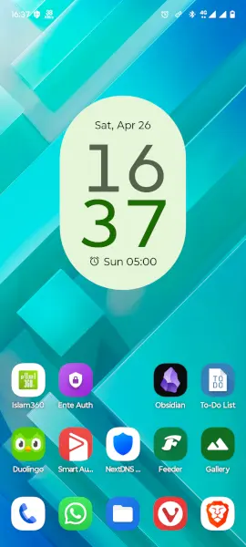

It happens to the best of us, we open TikTok, Reels, YouTube Shorts, just to pass time for 5/10 minutes, but end up spending hours on brain-rot doom scroll race for most of the free time on our hands. Constant nudging of 30 seconds of low effort flashy content activates our brain's reward center, and we keep on craving more dopamine in the form of staying more on these digital platforms.

As we spend more time on non-productive doom-scrolling, more and more dopamine is released as response to the shorts videos. The time goes by, and dopamine resistance is produced, as a cause, we need to spend more time on these short platforms to get the same level of hit. The dopamine hit which we use to get just by spending 5/10 minutes on these platforms in the beginning.

The same is true for all the social media platforms which are in the arms race of getting our attention. The more time we spend there, the more we get sunk in the algorithmic rabbit-hole. These social media platforms deploy some scary dystopian "dark magic" techniques to fight for our attention and time. We live in the attention economy, where we bombarded with the "free" content, whom we pay for, with our data and time.

## Why Should I Care?

Though in the intro, I went over this, but still some people will be like, I don't get sunk. I just spend some of my free time to refresh my mind and then get back to the real-life. I'm not addicted to social media or doom-scrolling dystopia. So, WHY SHOULD I CARE?

If you are not addicted, then congratulations, you are one in millions who have defeated the attention economy. You are immune to millions and millions of dollars of research aimed at getting into our heads. You can stop reading here and get back to your life, if nobody around you, likes of your friends and family, has caught themselves in the machine trap. But if your family and friends don't have iron curtains around their heads like you, you will definitely learn a thing or two in this blog to help them, get out of the attention trap.

## The Machine Trap!

In this day and age, the most precious and important thing every human being has is their attention. The companies compete fiercely for it and try to outrun each other in getting our exposure.

The attention generates digital footprints which can be sold to the advertisers for profit. To maximize the profit, they need to get more of our attention. So, they deploy more "Dark Sci-Fi" methods to keep us engaged on their platforms.

The people who give in to the algorithms, will soon find themselves in the echo chamber, where they don't hear the opposite opinions at all. That's undoubtedly intentional on the algorithm's part, as they are designed to feed the narrative you are most likely to engaged with.



Once you're trapped, not only you've paid the price with your data but also through your social and business circles. In the real life, when you will meet someone, and talk about some topic. You will most likely feel discontent while listening to other person's thoughts which don't align with your reasoning. In the process, you may lose not only the prospective good friends but also good clients.

## The Echo Chamber!

Being surrounded by like-minded people and feed, you start living in the echo chamber, where opposing views doesn't get past your feed. You start believing in the things which aren't true, but due to constant spoon-feeding by the algorithm of the similar content, you start believing in the obnoxious theories.

You immediately refute the ideas which aren't fitting with your world-view. When you're presented with the neutral opinions and thoughts, you consider them distasteful. The people who live in the echo chambers of their own, start losing the sense of real world and what's actually happening there.

## The Solution: Declutter Your Digital Realm

The most fundamental technique to escape the machine trap is, not to get-in in the first place. If you successfully overcome the urge to use Social Media, you will never get trapped. But I know, that's not very practical in the modern world. So, let's get to some practical tips and techniques.

### Clean Your Home Screen

On your phone, keep your home screen tidy from the temptations. Only keep apps which are the most essential ones for you. That way, no brain signals will be generated to open social media apps when you first open your phone by looking at the apps present on your home screen.

### Create a Friction

Creating a friction in the use of the most time-consuming apps is necessary to combat the machine trap effectively. If you open social media apps too frequently on your phone, just uninstall them, and use them via your phone's web-browser.

### Follow the Unfollow Rule

Don't follow every social media creator mindlessly. You won't miss anything. Follow creators who produce some valuable content, which either feed your mind or soul. Go to every Social Media app (including YouTube), and do some sweeping.

- Unsubscribe/unfollow creators you haven't watched for a while.
- Also, unfollow creators who feed you only dopamine, not value.
- Keep your subscriptions diverse to avoid the echo-chamber.

It's OK to watch some mindless content just for fun from time to time, but keep your guards up, so that you won't fall victim to the algorithmic loop.

## The Solution: RSS Feeds

RSS feeds using some RSS aggregator apps (Feeder, Newsflash etc.) allow you to break free from the algorithmic trap, by only getting the content from the sources you subscribe to.

- YouTube offers RSS feed for every channel, you can go to the specific channel click `share` and `copy` the channel link. Paste that link in the RSS Aggregator app, it will most likely pull the channel RSS feed itself.
- Almost every major news site, offers RSS subscriptions. Your RSS aggregator will populate that RSS feed link when put the website address, or you can use [Get RSS Feed URL](https://chromewebstore.google.com/detail/get-rss-feed-url/kfghpdldaipanmkhfpdcjglncmilendn) Chrome extension to extract RSS feed links from the websites you visit.
- Keep your sources at minimum. Keep them diverse, to avoid self-inflicted echo-chamber.



---
## References

- Anna Lembke, _Dopamine Nation: Finding Balance in the Age of Indulgence_ (2021), Dutton.
- "What is a Social Media Echo Chamber?" — University of Texas at Austin (2022). [Read here](https://advertising.utexas.edu/news/what-social-media-echo-chamber).
- Cinelli, M. et al., "The Echo Chamber Effect on Social Media," _PNAS_ (2021). [View study](https://doi.org/10.1073/pnas.2023301118).
- Karakostas, A., & Kompatsiaris, I., "On the Impossibility of Breaking the Echo Chamber Effect in Social Media Using Regulation," _Scientific Reports_ (2024). [See article](https://www.nature.com/articles/s41598-023-50850-6#citeas).
- Cover photo by Markus Spiske, via [Pexels](https://www.pexels.com/photo/display-coding-programming-development-1921326/).
