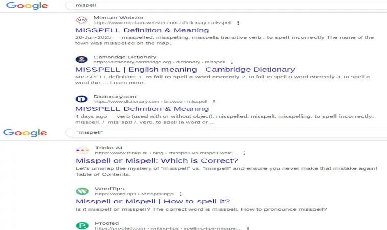

## What is Google Dorking?

Google Dorking is an **advance search technique**, which can find information about anything and everything from **the darkest and the deepest corners of the Internet**.

Google being the most used search engine, these techniques come-in handy to do Open Source Intelligence about your targets including **POI** (Point of Interest), **SOI** (Subject of Interest), **EOI** (Entity of Interest), or **NFI** (Need for Information).

Almost every Search Engine including Brave Search, DuckDuckGo, Startpage etc. support advance search operators. But the Google search have the most extensive support.

## Advance Search Operators

Following advance search operators can be used on almost all major search engines[^google-dorks-1] [^google-dorks-2] [^google-dorks-3] [^google-dorks-4].

> [!WARNING]
> I haven't tested all advance operators on every Search Engine. Most common operators will work fine, but more advance or nuance one will only work on Google.

> [!TIP]
> According to Google Search Help[^google-dorks-1], there should be no spaces between your search operator and search term. `site:wikipedia.com` is valid, while `site: wikipedia.com` is an invalid way of using these operators.

### Switch to Verbatim Mode

If you search for a particular model of a laptop battery on Google search, it will not only include that model's battery but batteries for other models too.

To instruct Google to search only for specific terms given in the search box and avoid showing unnecessary results switch to **verbatim mode**.


Click on <button>Tools</button> button on the top of a search page, and switch `All results` to `Verbatim`.

While using advance search operators, keep it on **verbatim** mode to get more accurate and precise results.

### The `" "` operator

The quotes operator lets you search for the specific word inside the quotes only, regardless of its spelling.

If you add other words beside the quoted word, google search must include quoted word in the results beside the other search terms.

```
How to spell "mispell" in American English?
```

To get more specific results you quote the whole string, and the individual words inside the string too.

```
"How to spell "mispell" in American English?"
```

It's a bad example, as it may not return any results, but conveys the point well. 



### The `+` and `-` operators

The `+` operator returns web pages containing the specified term either in the title or the body of the page.

```
The Office +'tv series'
```

It will search for pages that feature the term **The Office** referring to the TV series, not the Microsoft Office products.

To search the term **The Office**, we can exclude the web pages containing `Microsoft` in the title or the body of the page by using `-` operator.

```
The Office -microsoft
```

Using these operators, we can include or exclude specified words from title or body of the corresponding webpages.

### The `site:` operator

It helps you include or exclude searches from specific websites.

```
Why iPhones are Sh*t! site:reddit.com
```


To exclude a site from the results

```
Why iPhones are Sh*t! -site:reddit.com
```

The `-site:` operator will exclude the website mentioned after it. To include a website in the search results, you can use `+` operator like this `+site:`, but it's definitely redundant.


To search on top-level domain only:

```
How to boil an egg? site:gov
```

To get results from all the subdomains of a particular top-level domain:

```
How to file tax returns? site:*.gov.pk
```

### The `inurl:` and `allinurl:` operators

If you want to search something specifically, inside the URLs of the particular website only. It can be paired with `site:` operator to only include/exclude inURL searches from that particular website.

```
site:microsoft.com -inurl:https
```

This will look for http pages on microsoft.com including its subdomains.


The `allinurl:` operator search for pages with multiple words in the URL.

```
allinurl:microsoft copilot
```

It will include results, which contain both Microsoft and copilot in their URL.

### The `intitle:` and `allintitle` operators

To show only the results which have a single specified word in the title of the page and rest of the words anywhere:

```
intitle:max hard disk capacity
```

It will only look for **max** in the page title, while rest of the terms anywhere on the webpages.

To search for multiple terms in the title:

```
allintitle:hard disk capacity minimum
```

The `allintitle:` operator basically matches the terms like `OR` operator, if any of the mentioned terms have no results, they will still show if there are any results for the other mentioned terms.

| Operator      | Matches in Title    | Matches Elsewhere    | Use Case                                                     |
| ------------- | ------------------- | -------------------- | ------------------------------------------------------------ |
| `intitle:`    | Single word only    | Other words anywhere | When you want at least one word in title and others anywhere |
| `allintitle:` | All words specified | No                   | When you want all words to appear in the title               |

If you want to search for pages whose titles contain all the searched words use `allintitle:`. If you want pages whose title contains first word only and others anywhere in the search result use `intitle:`.

> [!INFO]
> There are `inanchor:` and `allinanchor:` operators which generally output the same results as `intitle:` and `allintitle:` combinations.

### The `*` wildcard operator

Asterisk acts as a wildcard, as a placeholder for one or more word (Accor. to **Thio Joe**[^thio-joe-youtube], It can hold 5 words). If you search for:

```
"how to make * at home"
```

Here `*` may act as a placeholder for pizza, candles etc.

### The `filetype:` operator

We can search for specific file types:

```
OSINT technique filetype:pdf
```

OR

```
OSINT technique ext:pdf
```


> [!ERROR]
> Using `filetype:`/`ext:` operator with media file types like, **mp4, mp3, m4a, WebM** etc. wouldn't work, due to copyright issues.

### The `AROUND n` operator

n = Number of words to look AROUND

This operator returns the results for the left and right terms to specified numbers of words in between.

```
"brain" AROUND 20 "first computer virus"
```

This will look for the results which include word **brain** and **first computer virus** within 20 words apart.


If you put `AROUND 0`, it means putting the left and right terms together without any word spacing.

> [!TIP]
> For Yandex use `term1 /+n term2`, or `term1 /-n term2`

### The `AND` and `OR`/`|` operators

If I search:

```
Cat Eggs
```

Google will try to look for the results containing both of these terms together.

But If I use `OR` operator between the two words, Google will show separate results for both **Cat** and **Eggs** terms.

```
Cat OR Eggs

OR

Cat | Eggs
```


If you use `AND` operator:

```
Cat AND Eggs
```

It pretty much shows the same results if you use both of these words together without any advance search operator.

### The `before:` and `after:` operators

Search for results from before a specific date:

```
Pakistan atomic program before:1998-05-28
```

It will show all the results from before 28 may 1998.

To get results after a specific year or date `before:yyyy-mm-dd`:

```
Pakistan Privacy laws after:2022
```

### The `loc` operator

Find results from a specified location.

```
loc:karachi Taj Mahal Hotel 
```


> [!TIP] Order of search term is important. `loc:` should be in the start. Don't use verbatim mode for this either.

## Brave Search Operators

[Brave Search](https://search.brave.com) support many of the [above-mentioned](#advance-search-operators) search operators.

But it also supports some **extra operators**[^brave-search-help]. I tested these on Google Search, but most of them either don’t work at all or don’t function as smoothly as they do in Brave Search.

The support for search operators is currently experimental in the Brave Search[^brave-search-help].

> [!TIP]
> While using quotes to include multiple words for an operator like `The Office inbody:"tv series"`, using `' '` will not work, and it shows an error. But if you use double quotes `" "`, the operator will apply properly.
> 

### The `inbody:` operator

It returns webpages containing the specified term in the body of the page.

Let's search:

```
DuckDuckGo inbody:"search operator"
```


### The `inpage:` operator

It outputs webpages containing the specified term either in the title or in the body of the page.

```
inpage:"DuckDuckGo search operators"
```

It will only show the results where all these words are either present in the title or in the body of the page it displays. Likewise, it doesn't matter if they appear together or scattered throughout the webpage.

### The `lang:` or `language:` operator

If you want to search for pages in the language of your choice. The language code must be in the [ISO 639-1](https://en.wikipedia.org/wiki/List_of_ISO_639-1_codes), English as `en`, Urdu as `ur` and Arabic as `ar`.

> [!ERROR]
> This search operator truly depicts why **Brave Search Team** says, this functionality is experimental[^brave-search-help]. Occasionally it shows the results in the specified language, and another time it didn't work at all, and it provides all kind of nonsense hits.

### The `loc:` or `location:` operator

It returns webpages from the specified country or region. The country code must be in [ISO 3166-1 alpha-2](https://en.wikipedia.org/wiki/ISO_3166-1_alpha-2#Officially_assigned_code_elements) format.

> [!ERROR]
> The operator is poorly supported. And almost never works as originally intended.

### The `NOT` operator

Brave Search support `AND` and `OR` logical operators. But `NOT` operator is a unique search operator supported only by Brave Search.

According to help page, you can use it like:

```
brave search NOT site:brave.com
```

It will exclude all the brave.com subdomains too.

> [!TIP]
> To achieve similar behavior on Google:
> ``` {linenos=false}
> brave search -site:brave.com
> ```
> It excludes subdomains too. While doing something like `-site:*.brave.com` doesn't work.

### The `!bang` support

You can directly search on websites from your Brave search homepage using `!bangs`[^brave-search-bangs]

```
!yt systemd is evil!
```

You will be directed to YouTube page with search results for term **systemd is evil!** 🙂.

## DuckDuckGo Advance Search Syntax

DDG supports many of the [advance search operators](#advance-search-operators). But it offers some unique search syntax[^duckduckgo-search-syntax] of its own too.

### The `filetype:` operator 

It supports only PDF`, `doc(x)`, `xlx(x)`, `ppt(x)`, HTML` filetypes.

> [!TIP]
> Apparently only Google supports searching for the documents having **open document formats** like **ODF, ODT** etc. using `filetype:` operator.

### The `~` operator

The DDG help pages[^duckduckgo-search-syntax] read:

> Example: `~"cats and dogs"`
> 
> Experimental syntax: more results that are semantically similar to "cats and dogs", like "cats & dogs" and "dogs and cats" in addition to "cats and dogs".

During my test, I got similar hits for `~"cats and dogs"`, `+"cats and dogs"`, `"cats and dogs"` and `cats and dogs`.

### The `\` and `!bang` operators

Using this, DuckDuckGo will directly open the first result for the search term.

```
\python
```

DDG supports [bangs operators](https://duckduckgo.com/bangs) originally. Brave Search adopted their specification later.


```
!g Hello World!
```

It will open the **Hello World!** search term directly on **Google Search**.

### Safe Search

Using `!safeon` or `!safeoff` beside their search terms, one can directly turn on/off the [safe search](https://duckduckgo.com/duckduckgo-help-pages/features/safe-search).


[^google-dorks-1]: "Refine Google searches" — Google Search Help. [Learn more](https://support.google.com/websearch/answer/2466433?hl=en)
[^brave-search-help]: "Search Operators" — Brave Search Help. [Read more](https://search.brave.com/help/operators)
[^google-dorks-2]: Joshua Hardwick, "Google Search Operators: The Complete List (44 Advanced Operators)", (2024). [Read more](https://web.archive.org/web/20250530115310/https://ahrefs.com/blog/google-advanced-search-operators/)
[^google-dorks-3]: Chima Mmeje, "62 Advanced Google Search Operators, Use Cases & Cheatsheet", (2025). [Blog post](https://moz.com/learn/seo/search-operators)
[^thio-joe-youtube]: Thio Joe, "You're Using Google WRONG — Do This Instead", (2025). [Watch on YouTube](https://www.youtube.com/watch?v=M3bduu2GGVU)
[^cover-photo]: Cover Photo by [Freepik](https://www.freepik.com/free-photo/portrait-hacker-with-mask_4473969.htm#fromView=search&page=1&position=26&uuid=1dcd8f82-595e-4d15-a3e7-896fdaf5d752&query=hacker+google+search).
[^brave-search-bangs]: "What !bangs can I use in Brave Search?" — Brave Help Center. [See more!](https://support.brave.app/hc/en-us/articles/4410152384781-What-bangs-can-I-use-in-Brave-Search)
[^google-dorks-4]: Sameeksha Medewar, "Download Google Dorks Cheat Sheet PDF for Quick References", 2025. [Read the blog!](https://hackr.io/blog/google-dorks-cheat-sheet)
[^duckduckgo-search-syntax]: "How to use advanced syntax on DuckDuckGo Search" — DDG Help Pages. [Learn more!](https://duckduckgo.com/duckduckgo-help-pages/results/syntax)