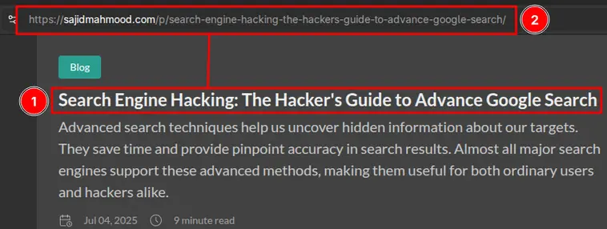
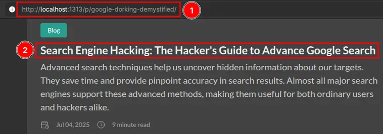

## Introduction

Before moving forward, let's define some terms:

**URL example:** `https://example.com/post/example-article-1`

| Name      | Definition                                         |
| --------- | -------------------------------------------------- |
| baseURL   | Actual domain of your blog, here it is `https://example.com` |
| Permalink | The rest of your post URL excluding your domain    |
| Slug      | The last portion of the URL, `/example-article-1`    | 

You can manipulate the last two portions of your content URL to make them look clean and shortened.

## URL Management

My website URL looked like this:



This is unnecessarily long, and using post title as a URL path.

So, after some coding wizardry, I was able to make them look like this:



Just kidding, it's a simple configuration change.

### Individual Posts

According to Hugo docs[^hugo-url-management] [^hugo-ugly-urls], you can modify and change your individual post URL via the frontmatter:

```yaml
URL: /my-beautiful-url
```

The post URL will look like this `https://example.com/my-beautiful-url`

> [!Caution]
> You can choose whatever URL you want for your posts, but keep in mind, they shouldn't conflict with each other. You might overwrite your pages and some of them won't appear at all.

### Site-wide Configuration

Earlier, my website `hugo.yaml` file looked liked this:

```yaml
permalinks:
    post: /p/:slug/
    page: /:slug/
```

I'm using page bundles ([Stack Theme](https://demo.stack.jimmycai.com/)), and I want to use the folder title for the specific post as a URL path.

So, I changed the config to:

```yaml
permalinks:
    post: /:filename/
    page: /:slug/
```

This will only show folder name as a URL path, and slice the `/p` part too. If you want to keep it:

```yaml
permalinks:
    post: /p/:filename/
    page: /:slug/
```

> [!WARNING] 
> If you are on Hugo `v0.144.0` or above, the `filename` token is deprecated[^hugo-permalinks], use `:contentbasename` instead. 

## Redirects for Old URLs

If you're just starting with your Hugo journey, you don't need to do this part, you can skip the rest of the tutorial.

But rest of us, who have shared the old URLs of their posts on multiple social media websites. Doing beautification, will break those older URLs.

To make sure, people from Social Media using older URLs of your posts can still reach the new destination, you need to make some changes in the **frontmatter of your posts**.

Add aliases of your older permalinks to the frontmatter of each blog:

```yaml
aliases:
    - /post/example-article-1
```

Now, one can reach your desired article using both new and old links:

For example, you can reach my blog post **Search Engine Hacking: The Hacker's Guide to Advance Google Search**, using the following two links:

> **New link:** [sajidmahmood.com/google-dorking-demystified](https://sajidmahmood.com/google-dorking-demystified/)

> **Older link:** [sajidmahmood.com/p/search-engine-hacking-the-hackers-guide-to-advance-google-search](http://sajidmahmood.com/p/search-engine-hacking-the-hackers-guide-to-advance-google-search/)

Both totally different links will lead to the same destination.

> [!TIP]
> If you have hundred of blog posts, and want some automation, you can look into `_redirects` file[^hugo-redirects]. It might work on **Netlify** and **Cloudflare Pages**. I haven't personally tested this redirection method.

[^cover-image-courtesy]: The Cover Page via the courtesy of Hugo. [Click here](https://gohugo.io/)
[^hugo-url-management]: URL management — Hugo Docs. [Read more](https://gohugo.io/content-management/urls/)
[^hugo-ugly-urls]: Configure ugly URLs — Hugo Docs. [Learn more](https://gohugo.io/configuration/ugly-urls/)
[^hugo-permalinks]: Configur permalinks — Hugo Docs. [Read more](https://gohugo.io/configuration/permalinks/)
[^hugo-redirects]: Harry Creswell, Hugo and redirects — 2021. [Learn more](https://harrycresswell.com/writing/hugo-netlify-redirects/)