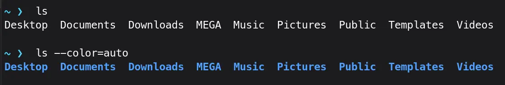
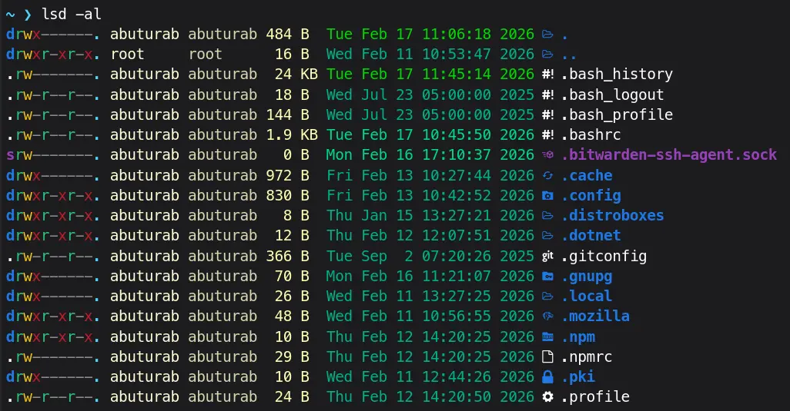
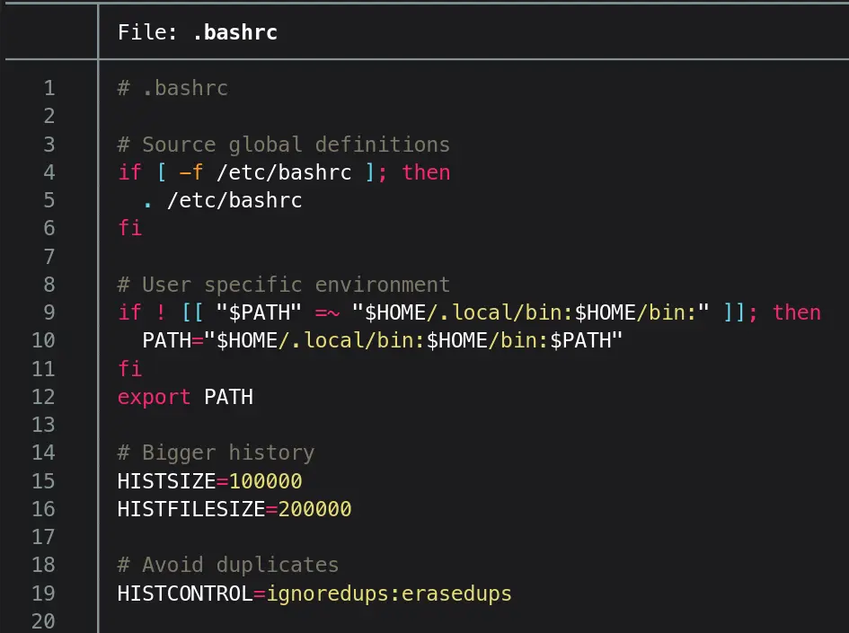
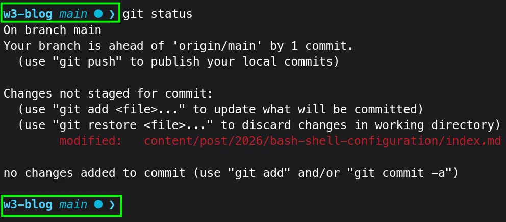

Bash is a default shell on all almost every major Linux distro. Let's see how we can make our life easier by modifying `bashrc`, while working in the terminal.

> [!CODE]- Click here to view my `.bashrc`
> You can just add it to your `.bashrc` and start using, if you know what you are doing.
> ```bash
> ## Bash History
> HISTSIZE=10000
> HISTFILESIZE=20000
> ### HISTFILE location
> export HISTFILE="$HOME/.bash_history"
> ### Ignore/Erase duplicates and spaces
> HISTCONTROL=ignoreboth:erasedups
> ### Append history
> shopt -s histappend
> ### Clear, Reload and Append
> PROMPT_COMMAND="history -a; history -c; history -r"
> 
> ## Check & Update Display Dimensions
> shopt -s checkwinsize
> 
> ## Smarter TAB Completion
> bind 'set completion-ignore-case on'
>
> ## Better Reverse History Search (Tested on Fedora Only)
> #if [[ $- == *i* ]]; then
> # __fzf_history__() {
> #   local selected
> #   selected=$(history | fzf --tac +s --reverse --height 40% |
> #     sed 's/^[ ]*[0-9]*[ ]*//') || return
> #   READLINE_LINE=$selected
> #   READLINE_POINT=${#READLINE_LINE}
> # }
> # bind -x '"\C-r": __fzf_history__'
> #fi
>
> ## Custom Environment Variables
> #export PATH=~/.cargo/bin/:$PATH
> #export PATH=~/.npm-global/bin:$PATH
> #export PATH=~/.local/bin:$PATH
> #export EDITOR="nvim"
> #export BUNDLE_PATH=~/.gems
> 
> ## Bitwarden SSH agent
> #export SSH_AUTH_SOCK=/home/abuturab/.bitwarden-ssh-agent.sock
> 
> ## Custom Aliases
> ### Smarter Copy and Move
> alias cp='cp -vi'
> alias mv='mv -vi'
> ### Better ls command
> alias ls='ls --color=auto'
> alias ll='ls -l --color=auto'
> alias la='ls -al --color=auto'
> alias lah='ls -alh --color=auto'
> ### Even Prettier ls (requires lsd)
> #alias ls='lsd'
> #alias ll='lsd -l'
> #alias la='lsd -al'
> ### better cat
> alias cat='less -N'
> #alias cat='cat -n' # Pipe it to less
> ### bat: a (cat) with wings
> #alias cat='alias bat'
> #alias cat='alias batcat' #Debian-based systems
> ### rm 
> alias `rm` = `rm -vi`
> ### Even Better rm (trash)
> #alias rm='trash -vi' #needs trash-cli package
> ### Better grep
> alias grep='grep -i --color=auto'
> ### Cloudflare Warp
> #alias connect="warp-cli connect"
> #alias disconnect="warp-cli disconnect"
> #alias status="warp-cli status"
> ### Editor
> #alias vim='nvim '
> 
> ## Starship Prompt
> eval "$(starship init bash)"
> ```
> > [!CAUTION] ''
> > This bashrc might break your shell, as some configurations need extra packages to be first installed on the system. I have commented out all those settings/aliases which require extra packages. 

Now, let's explain the configuration:

## Bash History

A Bash history file:
```bash{linenos=false}
export HISTFILE="$HOME/.bash_history"
```

Bigger bash history and in-memory history:
```bash{linenos=false}
HISTSIZE=10000
HISTFILESIZE=20000
```
- `HISTSIZE` Keeps up to 10,000 commands in the session memory
- `HISTFILESIZE` Keeps up to 100,000 commands in the history file

### Avoid Duplicates

To avoid duplicate spaces and matching commands in your history file:

```bash{linenos=false}
HISTCONTROL=ignoreboth:erasedups
```
- `ignoreboth` Ignore lines starting with spaces and matching lines in the history
- `erasedups` Remove duplicated lines from the history

### Append and Update History

When multiple terminal windows are opened, each session history won't overwrite the others.

```bash{linenos=false}
shopt -s histappend
```

To append latest command, clear and reload history file back into memory:

```bash{linenos=false}
PROMPT_COMMAND="history -a; history -c; history -r"
```

- `history -a` Append the latest command(s) from the current session to the history
- `history -c` clear the in-memory history of the current shell
- `history -r` Read the history files back into memory

## Check & Update Terminal Display Dimensions

Check the size of the terminal window after each command and if necessary update the values of lines and columns:
```bash{linenos=false}
shopt -s checkwinsize
```

The programs like `less`, `btop` etc., which rely on the window size to show information. With this option, they can update the information shown according the window dimensions.

## Reverse Search History <kbd>Ctrl</kbd>+<kbd>R</kbd>

To make reverse search better, install the `fzf` package, then:

```bash{linenos=false}
if [[ $- == *i* ]]; then
  __fzf_history__() {
    local selected
    selected=$(history | fzf --tac +s --reverse --height 40% |
      sed 's/^[ ]*[0-9]*[ ]*//') || return
    READLINE_LINE=$selected
    READLINE_POINT=${#READLINE_LINE}
  }
  bind -x '"\C-r": __fzf_history__'
fi
```

- <kbd>Ctrl</kbd>+<kbd>R</kbd> Search history in reverse
- <kbd>Ctrl</kbd>+<kbd>J</kbd> Move down in the history
- <kbd>Ctrl</kbd>+<kbd>K</kbd> Move up in the history
- <kbd>Enter</kbd> Add highlighted command to input shell, hit <kbd>Enter</kbd> again to run the command


> [!CAUTION] ''
> I have tested this only on Fedora


## <kbd>TAB</kbd> Completion

When you try to change directory using `cd`, and hit <kbd>TAB</kbd>, it completes the path for you. Default is case-sensitive completion, let's change it:

```bash{linenos=false}
bind 'set completion-ignore-case on'
```

Now using shell commands when you write `dow` and hit <kbd>TAB</kbd>, it will autocomplete to `Download` ignoring the case.

## Custom Environment Variables

Some necessary environment variables for development:

```bash{linenos=false}
export PATH=~/.cargo/bin/:$PATH
export PATH=~/.npm-global/bin:$PATH
export PATH=~/.local/bin:$PATH
export EDITOR="nvim"
export BUNDLE_PATH=~/.gems
```

## Custom Aliases

You can set custom aliases to gain some quality of life improvements:

### `cp` and `mv`

```bash{linenos=false}
cp -vi [Source] [Destination]
```

```bash{linenos=false}
mv -vi [Source] [Destination]
```

- `--verbose`/`-v` Explains what is being done
- `--interactive`/`-i` Prompt before overwrite

Let's make them an alias:

```bash{linenos=false}
alias cp='cp -vi'
alias mv='mv -vi'
```

So, it will show what are you copying, and before overwriting anything it will ask for confirmation \[Reply with `y` to continue].

### `ls` OR `lsd`

By default, `ls` output is not colorized.

Let's make it better:
```bash{linenos=false}
alias ls='ls --color=auto'
```



Other improvements:

```bash{linenos=false}
alias ll='ls -l --color=auto'
alias la='ls -al --color=auto'
alias lah='ls -alh --color=auto'
```

- `-l` Use a long listing format
- `-a`/`--all` show hidden files and DIRS (starting with `.`)
- `-h`/`--human-readable` Print human-readable sizes

We can go a step further and replace `ls` with `lsd`, which is even prettier with icons support.

> [!IMPORTANT] Installation Required
> First install `lsd` package available on Fedora (`dnf`), Debian/Debian-based distros(`apt`), and Archlinux(`pacman`), with your respective package manager.

```bash{linenos=false}
alias ls='lsd'
alias ll='lsd -l'
alias la='lsd -al'
```

We don't need `-h` as it's the default behavior for `lsd`


### `cat` OR `bat`

The `cat` command output what's in the file, without any beautification. 

Let's add:
```bash{linenos=false}
alias cat='less -N'
```
- `less` Interactively show contents of the files
- `-N`/`--LINE-NUMBERS` Causes a line number to be displayed at the beginning of each line.

> [!INFO] ''
> The `less` command doesn't support concatenation of outputs. If you rely on the feature use:
> 
> ```bash{linenos=false}
> cat -n FILE1 | less
> ```
> - `|` Pipes the output of previous command to next command

The more modern option is `bat`, which shows pretty colors with numbering, header with filename, and interactive viewing. 

> [!IMPORTANT] Installation Required
> You will need the `bat` package on your system.

```bash{linenos=false}
alias cat='alias bat'
OR
alias cat='alias batcat' #Debian-based systems
```

For full feature list [visit](https://github.com/sharkdp/bat).


### `rm` OR `trash`

The `rm` command deletes files or directories from the system.

```bash{linenos=false}
alias `rm` = `rm -vi`
```
- `-v`/`--verbose` Explain what is being done
- `-i` Prompt before every removal

The `rm` command directly removes the files from the system without first moving them to the trash/recycle bin.

A better way to remove files is using `trash-cli`. It moves files to the recycle bin, in case of any accidental deletion, we restore deleted content via `trash-restore`. It also removes directories without any further flag/s needed. 

> [!IMPORTANT] Installation Required! 
> Please install `trash-cli` package first on your distro of choice.

```bash{linenos=false}
alias rm='trash -vi'
```

### `grep`

To colorize `grep`:
```bash{linenos=false}
alias grep='grep -i --color=auto'
```
- `-i`/`--ignore-case` Ignore case distinction in patterns or input data

## Beautify the Prompt

Install [starship](https://starship.rs/) package first, then add following to the end of `.bashrc`:

```bash{linenos=false}
eval "$(starship init bash)"
```

Check out my minimalist `starship` config:
<details>
<summary>Click here...</summary>

```bash
add_newline = true
command_timeout = 200
format = "[$directory$git_branch$git_status]($style)$character"

[character]
error_symbol = "[✗](bold cyan)"
success_symbol = "[❯](bold cyan)"

[directory]
truncation_length = 2
truncation_symbol = "…/"
repo_root_style = "bold cyan"
repo_root_format = "[$repo_root]($repo_root_style)[$path]($style)[$read_only]($read_only_style) "

[git_branch]
format = "[$branch]($style) "
style = "italic cyan"

[git_status]
format     = '[$all_status]($style)'
style      = "cyan"
ahead      = "⇡${count} "
diverged   = "⇕⇡${ahead_count}⇣${behind_count} "
behind     = "⇣${count} "
conflicted = " "
up_to_date = " "
untracked  = "? "
modified   = " "
stashed    = ""
staged     = ""
renamed    = ""
deleted    = ""
```
</details>

Save it as `starship.toml` to `~/.config/`.


> [!TIP] Documentation
> Checkout the starship [configuration docs](https://starship.rs/config/), for more options and example configs.

## References

- [Bash Reference Manual](https://www.gnu.org/savannah-checkouts/gnu/bash/manual/bash.html) --- Official Manual
- [Bash: Tips & Tricks](https://wiki.archlinux.org/title/Bash) --- The ArchWiki