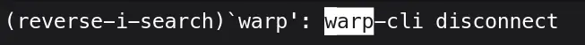
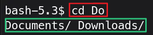
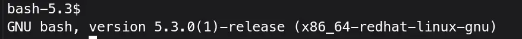

> [!TIP] ''
> If you are looking for `.bashrc` config customization tutorial, please read [Practical BASHRC Tweaks](/bash-shell-configuration/) guide.

As a Linux user, working in the terminal should be a pleasure not a thorn. Let's discuss some useful tips and tricks for a terminal with bash shell (With default `bashrc`). These are the command or keyboard shortcuts which can be useful while working in the terminal.

> [!NOTIFY] ALERT
> There are two modes of Bash shell, `emacs` and `vi`, by-default it is set to `emacs` unless you change it. Most of the key binds mentioned here only work in the default `emacs` mode. To change the mode, `set -o vi/emacs`.

## See all the Terminal Shortcuts

Type in the terminal:
```bash{linenos=false}
bind -p
```

It will list down all the available shortcuts currently bound (available) and not bound for bash shell. 

## Clear the terminal

You can type:
```bash{linenos=false}
clear
```

It will clear all the outputs from the Terminal screen.

The better is to press <kbd>Ctrl</kbd> + <kbd>L</kbd> which will clear out the screen.

## Exit from the Terminal

To exit, type in the CLI:
```bash{linenos=false}
exit
```
It will close the Terminal window.

Or the better is to press <kbd>Ctrl</kbd> + <kbd>D</kbd> shortcut to close the terminal.

> [!INFO] ''
> The keyboard shortcut to close or exit the terminal only works when no terminal processes are running. As running program like `top`, `less` etc., receives that command instead of the terminal.

## Reverse History Search

Pressing <kbd>Ctrl</kbd> + <kbd>R</kbd>, puts you in the reverse history search mode.


Type a word, and you can press <kbd>Ctrl</kbd> + <kbd>R</kbd> multiple times, to see all occurrences of that word in the bash history.

When you find a command you're looking for, press <kbd>Enter</kbd>, it will immediately run the command.

But if you don't want to run the command directly, press <kbd>Ctrl</kbd> + <kbd>J</kbd>, it will copy the command to the CLI without running it.

## Stop the Running Process

To stop a running process in the terminal, press <kbd>Ctrl</kbd> + <kbd>C</kbd>, it sends `SIGINT` (interrupt) signal to the process running in the foreground.

Or press <kbd>Ctrl</kbd> + <kbd>Z</kbd> to send `SIGSTP` (suspend) signal to the process running in the foreground.

## Accepting the CLI Commands

To accept the CLI command, press <kbd>Enter</kbd>.

But you knew that already, didn't you? Let's learn the pro way:
- The key combinations like <kbd>Ctrl</kbd> + <kbd>J</kbd> and <kbd>Ctrl</kbd> + <kbd>M</kbd> also act as a Carriage Return(CR) in the terminal.

## Moving Around

Jumping around:
- Press <kbd>Ctrl</kbd> + <kbd>A</kbd> to move the cursor to the start of the line.
- Press <kbd>Ctrl</kbd> + <kbd>E</kbd> and the cursor jumps to the end of the line.

Moving character by character on the CLI commands:
- To move one character forward <kbd>Ctrl</kbd> + <kbd>F</kbd>
- To move one character backwards <kbd>Ctrl</kbd> + <kbd>B</kbd>

## Editing/deleting Commands

Character by character deletion:
- To delete one character backwards from the cursor, press <kbd>Ctrl</kbd> + <kbd>H</kbd>
- To delete one character forward from the cursor position <kbd>Ctrl</kbd> + <kbd>D</kbd>

Word-by-word deletion:
- To delete the whole word, before a cursor, press <kbd>Ctrl</kbd> + <kbd>W</kbd>
- To delete the whole word, after a cursor, hit <kbd>Alt</kbd> + <kbd>D</kbd>

End/start of the line deletion:
- Press <kbd>Ctrl</kbd> + <kbd>K</kbd>, to delete from cursor to end of the line
- Press <kbd>Ctrl</kbd> + <kbd>U</kbd>, to delete from cursor to beginning of the line

Deletion by Word/Start/end of line, also acts as `cut` command, and to repaste what's yanked, hit <kbd>Ctrl</kbd> + <kbd>Y</kbd>, then cycle through yanked items by pressing <kbd>Alt</kbd> + <kbd>Y</kbd> numerous times.

## Insert argument of last Command

If we run
```
ls -alh
```

If we type only `ls` in the CLI, and hit <kbd>Alt</kbd> + <kbd>.</kbd>, it will inset the last argument of previous command, `-alh` in this case.

Keep pressing the key bind, to cycle through all last arguments of the previous commands.

## Edit and Execute Command

You're working with some large CLI commands, and want to easily edit them.

Press <kbd>Ctrl</kbd> + <kbd>X</kbd>/<kbd>Ctrl</kbd> + <kbd>E</kbd> together in one go, the command written in the CLI will open up in the default text editor.

After making necessary changes, exit the editor saving the command, the newly edited command will run in the CLI directly after that. Or quit the editor without saving the command.

To print your default editor:
```bash{linenos=false}
echo $EDITOR
```

To set your default editor, add the following line to your `.bashrc`
```bash{linenos=false}
export EDITOR=nvim
```

## Searching through Bash History

On the CLI, hitting <kbd>Ctrl</kbd> + <kbd>P</kbd>, it will cycle through previous bash history commands.

To move through history in forward, hit <kbd>Ctrl</kbd> + <kbd>N</kbd>. Both these two shortcuts can be combined to move forward or in reverse.

## Possible Command and Path Completions

While writing a command, or a path, and hitting <kbd>TAB</kbd>, will complete or show possibilities of commands or paths.
```bash{linenos=false}
cd Do
```
Hit <kbd>TAB</kbd>, it will list down all possible paths starting with `Do`.


## The `nohup` Command

When you run `firefox` in the terminal:
```bash{linenos=false}
firefox
```
If the Terminal is close down, it will close the `firefox` application too.

Running `firefox` with `nohup` (no hang up) signal, close the terminal will not stop the app from running.
```bash{linenos=false}
nohup firefox
```

To make it truly a background process:
```bash{linenos=false}
nohup firefox &
```

## The `bg` and `fg` Commands

Running `bg` in the terminal will list down the processes running in the background.

To run, any process or app in the background add ampersand `&` at the end of their name:
```bash{linenos=false}
top &
```

To bring it to the foreground:
```bash{linenos=false}
fg %top
```

If single background process is running, only using `fg` to bring it to the foreground will suffice. 

> [!CAUTION] BE CAREFUL!
> Unlike `nohup` command, closing the terminal window, will kill all the background running processes.

## Terminate/Kill Processes

To kill a frozen or misbehaving process from the terminal

```bash{linenos=false}
pkill firefox
```

## Forgot to Run with `sudo`

It happens to the best of us, we ran a command, but it was supposed to run with the `sudo` privileges.

To run the previous command with `sudo`:
```bash{linenos=false}
sudo !!
```
- `!!` Repeats the last command


## Not So Sexy Neofetch

You don't need an extra tool to see all the information about your distro and hardware:
```bash{linenos=false}
cat /etc/os-release
```

Not so pretty, but works all the time.

## Display Shell Version

Press <kbd>Ctrl</kbd> + <kbd>x</kbd> and <kbd>Ctrl</kbd> + <kbd>v</kbd> together to print the shell version in the CLI.


## References

- [What is your single most favorite command-line trick using Bash?](https://stackoverflow.com/questions/68372/what-is-your-single-most-favorite-command-line-trick-using-bash) --- The OG Stack Overflow
- [Bash Command Line Tips to Help You Work Faster](https://www.freecodecamp.org/news/bash-command-line-tips-to-help-you-work-faster/) --- The freeCodeCamp