## DNF5 Configuration `dnf.conf`

To improve package cache, colored display output etc., add the following lines to your `/etc/dnf/dnf.conf` file.

```conf
[main]
color=true
max_parallel_downloads=10
keepcache=true
defaultyes=true
```
- `color` Enables color output during `DNF` operations
- `max_parallel_downloads` Enables parallel downloading for faster updates & installations
- `keepcache` Keep downloaded packages in the Cache
- `defaultyes` If enabled default answer to user confirmation prompt will be **Yes**
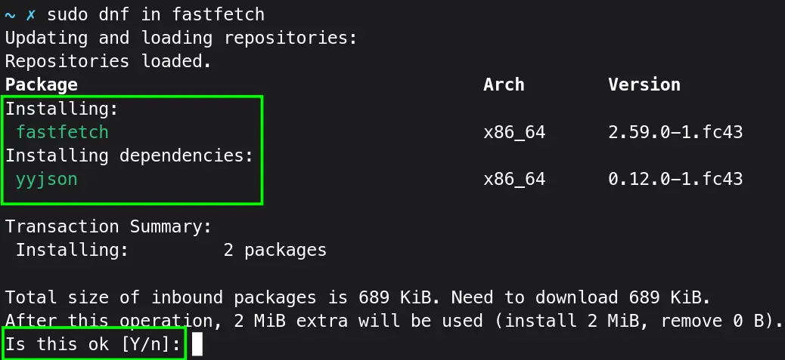

You can also add:
```
fastestmirror=true
```

It will rate the mirror based on latency. But not all mirrors have up-to-date packages, you might see mirror errors during updates and installations.
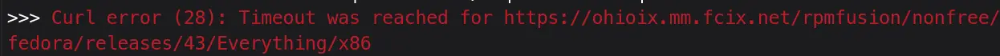
The `DNF5` can automatically handle mirrors based on their availability and speed. You don't generally need this option.

## Upgrade

### System

Go to `Gnome-Software` and Click on `updates` tab. Then Click <kbd>Downloads</kbd> button.

Or upgrade via `DNF`:
```
sudo dnf update
```

And **Restart** your system.

## Firmware

You can update your firmware (BIOS, Device Drivers) if your system supports it:
```console{linenos=false}
sudo fwupdmgr refresh --force
sudo fwupdmgr get-devices # Lists devices with available updates.
sudo fwupdmgr get-updates # Fetches list of available updates.
sudo fwupdmgr update
```

You may need to restart to apply updates.
> [!WARNING]
> BIOS updates can brick your PC. Be careful with BIOS updates.

## Beautiful Cursors

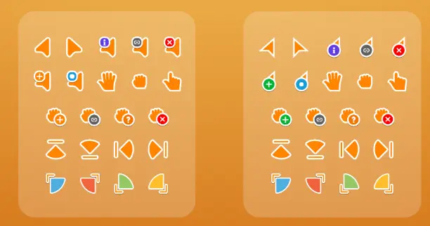

First install `gnome-tweaks`, it will be helpful in many ways.
```console{linenos=false}
sudo dnf install gnome-tweaks
```

Download the [Bibata Cursors](https://github.com/ful1e5/Bibata_Cursor/releases), from their release page, or with the following command directly:
```console{linenos=false}
wget https://github.com/ful1e5/Bibata_Cursor/releases/latest/download/Bibata.tar.xz
```

Let's make an `icon` directory:
```console{linenos=false}
mkdir -p ~/.local/share/icons
```

Now let's extract the `Bibata.tar.xz` to the `icons` directory:
```console{linenos=false}
tar -xvf Bibata.tar.xz -C ~/.local/share/icons
```
- `tar` Archival and extraction utility
- `-x`/`--extract` Extract files from an archive
- `-v`/`--verbose` Verbosely list files processed
- `-f`/`--file=ARCHIVE` Use archive filename or device ARCHIVE
- `-C`/`--directory=DIR` Change to **DIR** before performing any operations

Now just open `gnome-tweaks` app, go to `Appearance`. Under `Styles > Cursors`, change it to your liking:
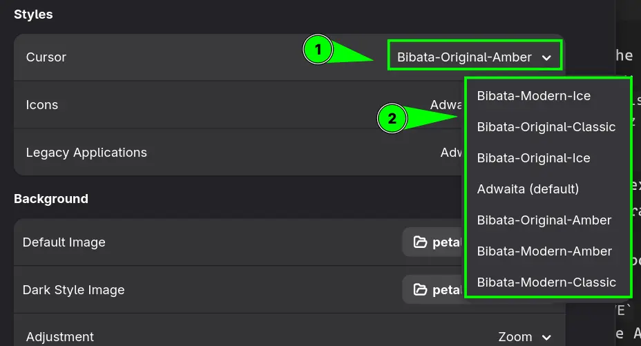

## RPM Fusion: Free and Non-Free

RPM Fusion repos are necessary to obtain pieces of software which are not available in the Official Repos due to licensing restrictions like multimedia codecs, GPU drivers etc.

Using `DNF`:
```console{linenos=false}
sudo dnf install https://mirrors.rpmfusion.org/free/fedora/rpmfusion-free-release-$(rpm -E %fedora).noarch.rpm https://mirrors.rpmfusion.org/nonfree/fedora/rpmfusion-nonfree-release-$(rpm -E %fedora).noarch.rpm
```

To enable WebRTC support:
```console{linenos=false}
sudo dnf config-manager --enable fedora-cisco-openh264
```

[Appstream metadata](https://www.freedesktop.org/wiki/Distributions/AppStream/?__goaway_challenge=meta-refresh&__goaway_id=8d16de108595959949421d02eb36d6b0&__goaway_referer=https%3A%2F%2Frpmfusion.org%2F) provide GUI way to install RPM Fusion packages via GNOME Software or KDE Discover.
```bash{linenos=false}
sudo dnf update @core

# Since DNF5(F41 & later), the Fedora groups cannot be extended by RPM Fusion. So you need to mention the package explicitly

sudo dnf install rpmfusion-\*-appstream-data
```

> [!TIP]
> Official Configuration [Guide](https://rpmfusion.org/Configuration) for RPM Fusion Setup

## Multimedia Codecs

It's a good idea to switch to full `ffmpeg` package to avoid version mismatches.
```console{linenos=false}
sudo dnf swap ffmpeg-free ffmpeg --allowerasing
```

 ### Install Additional Codecs

To play all kinds of multimedia in Browsers as well as through multimedia players.
```console{linenos=false}
sudo dnf update @multimedia --setopt="install_weak_deps=False" --exclude=PackageKit-gstreamer-plugin
```

### Hardware Accelerated Codec

#### Intel

For Intel Recent Hardware (rpmfusion-nonfree):
```console{linenos=false}
sudo dnf install intel-media-driver
```
For Broadwell (5th gen) and newer chipsets particularly Ice Lake (10th gen) and newer.

For older Hardware (rpmfusion-free):
```console{linenos=false}
sudo dnf install libva-intel-driver
```

#### Hardware codes with AMD (mesa)

This is needed since Fedora 37 and later. It mainly concerns the AMD hardware:
```console{linenos=false}
sudo dnf swap mesa-va-drivers mesa-va-drivers-freeworld
```

If using i686 compact libraries (for steam or a likes) for older 32-bit systems:
```console{linenos=false}
sudo dnf swap mesa-va-drivers.i686 mesa-va-drivers-freeworld.i686
```

> [!TIP]
> For NVIDIA, Broadcom Network Drivers, DVD drivers, [checkout](https://rpmfusion.org/Howto/Multimedia) the official detailed guide.

> [!INFO]
> [Checkout](https://fedoraproject.org/wiki/Hardware_Video_Acceleration) Official Hardware Video Acceleration Guide for Fedora. Also, Firefox Hardware Video Acceleration [Guide](https://fedoraproject.org/wiki/Firefox_Hardware_acceleration).

### Brave and Chromium: Hardware Video Acceleration

You will need following flags to enable hardware-based video acceleration on Brave and chromium based browsers.

Add following config to `brave-flags.conf` file to `$HOME/.config/` directory:
```sh
--ozone-platform=wayland
--ozone-platform-hint=wayland
--enable-features=TouchpadOverscrollHistoryNavigation
#extension=~/.local/share/omarchy/default/chromium/extensions/copy-url
# Chromium crash workaround for Wayland color management on Hyprland - see https://github.com/hyprwm/Hyprland/issues/11957
#--disable-features=WaylandWpColorManagerV1
```

For Chromium/Chrome browser save following config to `chromium-flags.conf` or `chrome-flags.conf` to `$HOME/.config/` directory:
```sh
--ozone-platform=wayland
--ozone-platform-hint=wayland
--enable-features=TouchpadOverscrollHistoryNavigation
--enable-features=AcceleratedVideoDecodeLinuxGL
--enable-features=AcceleratedVideoDecodeLinuxZeroCopyGL
--enable-features=AcceleratedVideoDecodeLinuxGL,AcceleratedVideoEncoder
# Chromium crash workaround for Wayland color management on Hyprland - see https://github.com/hyprwm/Hyprland/issues/11957
#--disable-features=WaylandWpColorManagerV1
```

## Flathub Repo

To [add](https://flathub.org/en/setup/Fedora) official Flathub repo:
```console{linenos=false}
flatpak remote-add --if-not-exists flathub https://dl.flathub.org/repo/flathub.flatpakrepo
```

Fedora comes with the **Fedora Flathub Repo**, which has limited number of apps curated by Fedora Maintainers, not the respective app developers. To remove it:
```console{linenos=false}
flatpak remote-delete fedora
flatpak remote-delete fedora-testing
```

## Disable GNOME <kbd>Super</kbd> + <kbd>NUM</kbd> Keybinds

On Fedora Workstation, pressing any number from **0** to **9** with <kbd>Super</kbd> key, will open respective app from GNOME dock. Let's disable it for good:
```console{linenos=false}
for i in $(seq 1 9); do gsettings set org.gnome.shell.keybindings switch-to-application-${i} "[]"; done
```

The <kbd>Super</kbd> + <kbd>NUM</kbd> can be better use for quickly switching among GNOME workspaces.

## GNOME Extensions

I like clean GNOME experience with only my chosen few extensions. Let's remove default Fedora Workstation Extensions:

```
sudo dnf remove gnome-shell-extension-window-list gnome-shell-extension-window-list
```

I had these two installed by default. To check whether there are more:
```
dnf list --installed | grep gnome-shell-extension
```
It will list all the installed packages and then using `grep` will only print packages with `gnome-shell-extension` pattern in their name.

> [!INFO] ''
> These default extensions can only be uninstalled via `DNF`, **Extension Manager** will have no uninstall option for them.

### GNOME: Extension Manager

It allows you to manage and install gnome extensions in a single application.

Let's install:
```
flatpak install com.mattjakeman.ExtensionManager
```

My minimal but useful extension list:
1) **AppIndicator and KStatusNotifierItem Support**: 
It will add Notification tray icon support.

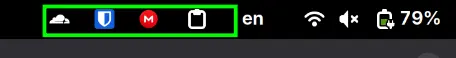

2) **Caffeine**: 
Disable screensaver and auto suspend.

3) **Copyous**: 
My favorite and most used tool, a clipboard manager with text & images support.
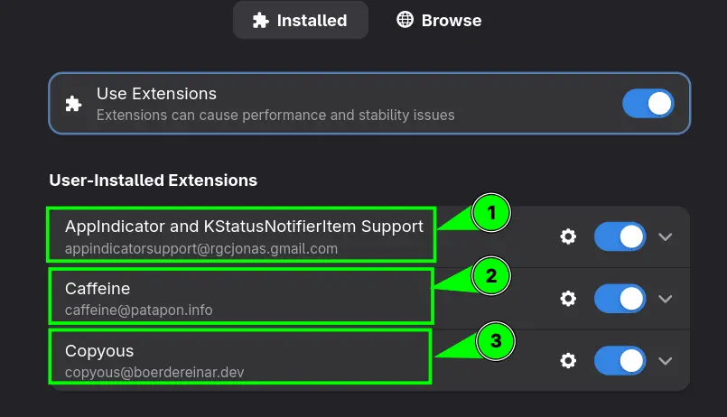

There are many more extensions available. You can choose whatever you like. I'm personally a fan of default GNOME experience with necessary extensions only.

## System Backups: Btrfs Assistant

Fedora uses `btrfs` file system. Backups can be extremely fast.

Let's install:
```
sudo dnf in btrfs-assistant
```

Open `btrfs-assistant` app, go to `snapper settings` create a backup config like this:

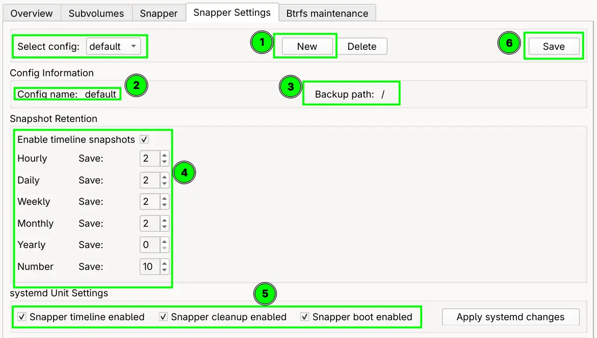

After sometime, backups will start appearing in the `Snapper` section of the app. The `btrfs-assistant` app will take of backups creation and cleanups, but you can manually create and delete backups too.

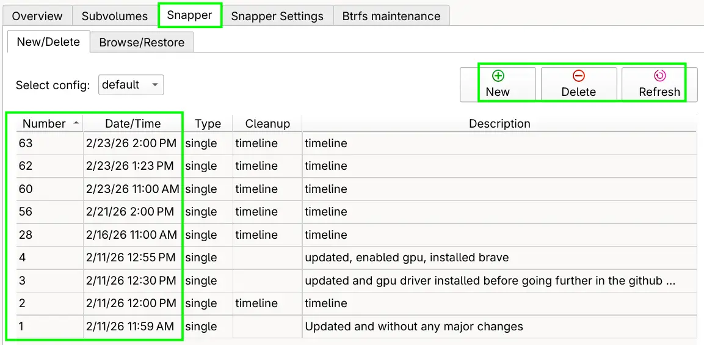

## Useful Applications

Improve your Fedora experience with useful apps. Following apps are recommended and used by me.

### Brave Browser

[Add](https://brave.com/linux/#release) `brave-browser` repository and install:
```console{linenos=false}
sudo dnf install dnf-plugins-core

sudo dnf config-manager addrepo --from-repofile=https://brave-browser-rpm-release.s3.brave.com/brave-browser.repo

sudo dnf install brave-browser
```

> [!INFO]- To install Chrome. Click here...
> You can go to **Software Center**. Click **three dots** buttons, then **Software Repositories** and enable **Google Chrome** repo. Hit the refresh button, then search and install Chrome Browser.
>
> Alternatively, you can install it from Flathub, but it will need extra steps to enable hardware video acceleration.

Chromium is available through Fedora repos:
```console{linenos=false}
sudo dnf in chromium
```

> [!TIP] ''
> Firefox comes pre-installed on Fedora.

### Visual Studio Code

[Install](https://code.visualstudio.com/docs/setup/linux) the key and add yum repo:
```console{linenos=false}
sudo rpm --import https://packages.microsoft.com/keys/microsoft.asc &&
echo -e "[code]\nname=Visual Studio Code\nbaseurl=https://packages.microsoft.com/yumrepos/vscode\nenabled=1\nautorefresh=1\ntype=rpm-md\ngpgcheck=1\ngpgkey=https://packages.microsoft.com/keys/microsoft.asc" | sudo tee /etc/yum.repos.d/vscode.repo > /dev/null
```

Then update package cache and install the package:
```sh{linenos=false}
dnf check-update &&
sudo dnf install code # or code-insiders
```

### Screenshots: Gradia and Flameshot

[Gradia](https://github.com/AlexanderVanhee/Gradia) is a screenshot taking and annotation tool. It's available as flatpak:
```console{linenos=false}
flatpak install be.alexandervanhee.gradia
```

Add custom shortcut to via GNOME settings:
```console{linenos=false}
flatpak run be.alexandervanhee.gradia --screenshot=INTERACTIVE
```
It will take interactive screenshot via GNOME's built-in tool, then pipe that image to Gradia.

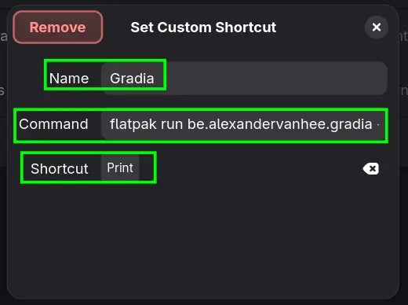

[Flameshot](https://github.com/flameshot-org/flameshot) is another great screenshot tool with annotation support.
```
sudo dnf install flameshot
```
Due to Wayland limitations, it doesn't run without certain changes.

Let's make a script:
```sh
#!/bin/sh
# Fix 'Unable to Capture Screen'
export QT_QPA_PLATFORM=wayland
# Fixes Copy to Clipboard not working
sh -c "QT_QPA_PLATFORM=xcb flameshot gui -r | wl-copy"
```

Save these lines to `flameshot-fix` file. Put this file inside `$HOME/local/bin/` directory. Make it executable:
```
chmod +x flameshot-fix
```
- `+x` Makes script file executable, without you can't run it

Make sure `$HOME/.local/bin` is in the path. Add this to your `.bashrc`
```bash{linenos=false}
export PATH=~/.local/bin:$PATH
```
Close the terminal and open again.

Let's create a GNOME custom shortcut:

**Name:** Flameshot

**Command:** flameshot-fix

**Shortcut:** [YourChoice]

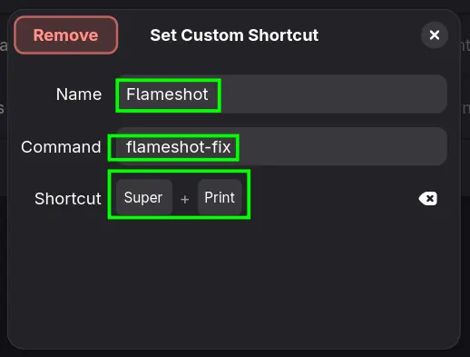

### Bitwarden

It's a free and open-source Password Manager of choice. Let's [install](https://bitwarden.com/download/#downloads-desktop) it:
```sh{linenos=false}
latest=$(curl -s https://api.github.com/repos/bitwarden/clients/releases/latest \
         | grep "browser_download_url.*x86_64.rpm" \
         | cut -d '"' -f 4)
wget "$latest"
```
The `curl` commands uses GitHub API to fetch latest package name and pass it to variable `latest` which is turn used by `wget` to download.

Run inside the download directory
```console{linenos=false}
sudo dnf install ./Bitwarden*.rpm
```

Or install it via `Flathub`:
```console{linenos=false}
flatpak install com.bitwarden.desktop
```

### Obsidian

[Obsidian](https://obsidian.md/download) is a note-taking app:
```console{linenos=false}
flatpak install md.obsidian.Obsidian
```

### MegaSync Desktop

Mega is cloud storage solution like Google Drive. [Install](https://mega.io/desktop#download) it via:
```sh{linenos=false}
wget https://mega.nz/linux/repo/Fedora_42/x86_64/megasync-Fedora_42.x86_64.rpm && sudo dnf install "$PWD/megasync-Fedora_42.x86_64.rpm"
```
It will install `megasync` app, and add the repo to `/etc/yum.repos.d/` directory. Subsequent upgrades can be done via `DNF`.

### Cryptomator

It's a File based Encryption tool. Let's [install](https://cryptomator.org/downloads/#linux) it:
```console{linenos=false}
flatpak install org.cryptomator.Cryptomator
```

### VPNs: Windscribe, ProtonVPN and Cloudflare Warp

To install windscribe:
```console{linenos=false}
sudo dnf install windscribe
```
[Windscribe](https://windscribe.com/) is a privacy respecting VPN provider. It also gives 10 GB free VPN usage data per month.

[ProtonVPN](https://protonvpn.com/support/official-linux-vpn-fedora) has more involved installation process.

Download the package containing Repo config and keys:
```console{linenos=false}
wget "https://repo.protonvpn.com/fedora-$(cat /etc/fedora-release | cut -d' ' -f 3)-stable/protonvpn-stable-release/protonvpn-stable-release-1.0.3-1.noarch.rpm"
```

Install the ProtonVPN repo:
```console{linenos=false}
sudo dnf install ./protonvpn-stable-release-1.0.3-1.noarch.rpm && sudo dnf check-update --refresh 
```

Install the app:
```console{linenos=false}
sudo dnf install proton-vpn-gnome-desktop 
```
Accept OpenPGP key during installation by replying `y` to the prompt.

To show system tray icon (optional):
```console{linenos=false}
sudo dnf install libappindicator-gtk3
```
It requires **AppIndicator and KStatusNotifierItem Support** extension installed on the GNOME system. Restart.

To completely remove the ProtonVPN app, follow the [official guide](https://protonvpn.com/support/official-linux-vpn-fedora).

Check [detailed guide](/cloudflare-warp-on-linux/) on installation and configuration of `cloudflare-warp` on Linux.


### Virtual Machine Manager

Fedora comes preconfigured with `KVM/QEMU` support. It comes bundled with `gnome-boxes`, but it's very limiting so uninstall it:
```console{linenos=false}
sudo dnf remove gnome-boxes
```

Let's install `virt-manager`:
```console{linenos=false}
sudo dnf install virt-manager
```

To fix passwords prompts on opening **Virtual Machine Manager**, [see this](/virt-manager-permissions-fix/).

### Distrobox

[Distrobox](https://distrobox.it/) helps you run any Linux distribution inside your terminal. Fedora comes preconfigured with `podman` and `toolbox` which is what `distrobox` is based on.

The `toolbox` only supports Fedora with pretty limited features, let's get rid of it:
```console{linenos=false}
sudo dnf remove toolbox
```

And install `distrobox`:
```console{linenos=false}
sudo dnf install distrobox
```

### Misc.

Let's install `FFaudioConverter`, `Flatseal`, `GIMP`, `Kid3`, `LocalSend`, and `Calibre`:
```console{linenos=false}
flatpak install com.github.Bleuzen.FFaudioConverter com.github.tchx84.Flatseal org.gimp.GIMP org.kde.kid3 org.localsend.localsend_app com.calibre_ebook.calibre
```
- `FFaudioConverter` Audio conversion and compression app
- `GIMP` FOSS Photoshop alternative
- `Kid3` Audio metadata Editor
- `LocalSend` Sends and Receives file via Local Network
- `Calibre` E-Book reader and metadata editor

Install few useful programs for Fedora repos:
```
sudo dnf install neovim imagemagick tealdeer bat lsd yazi tmux fzf ripgrep fd-find seahorse
```
- `neovim` CLI text editor
- `imagemagick` CLI based image display and manipulation program
- `tealdeer` Show simplified usage of CLI commands with examples
- `bat` Better `cat`
- `lsd` Better `ls`
- `yazi` Terminal based file manager with vim keybindings
- `tmux` Terminal multiplexer
- `fzf` A CLI fuzzy finder
- `ripgrep` A better `grep`
- `fd-find` A better `find`
- `seahorse` GNOME encryption keys manager, a keyring manager

## Fix GTK3 Apps Theming

To fix theming for `megasync`, `cloudflare-warp` please install:
```console{linenos=false}
sudo dnf install adw-gtk3-theme
```

Open `gnome-tweaks` app, go to `Appearance` tab, under `Styles > Legacy Applications`, select `Adw-gtk3-dark`
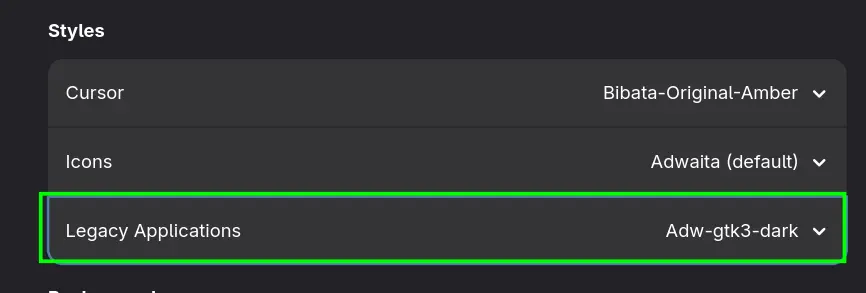

For Flatpak's like `FFaudioConverter` and `Obsidian`:
```console{linenos=false}
flatpak install org.gtk.Gtk3theme.adw-gtk3 org.gtk.Gtk3theme.adw-gtk3-dark
```
Flatpak applications should pick up the right theme automatically. Reboot, if theming is still bad [see this](https://github.com/lassekongo83/adw-gtk3).


## References

- [Fedora 43 Post Install Guide](https://github.com/devangshekhawat/Fedora-43-Post-Install-Guide) --- A Great Optimization Guide
- [Bash CLI Tips & Tricks](/bash-terminal-tips-tricks/) --- Learn Terminal Superpowers
- [Practical BASHRC Tweaks](/bash-shell-configuration/) --- Make Your Terminal, a Beautiful Place to Spend Time
- [How to Diagnose and Fix Slow Boot on SystemD-based Linux Distros](/investigating-long-startup-time-on-linux/) --- Investigate and Fix Slow Boot-up
- [GNOME: ScreenIdle and ScreenLock Customization](/gnome-sceenlocking/) --- If You Love KDE Screen Idle and Lock Settings
- [Managing dotfiles the Right Way: GNU Stow and ln -s](/linux-dotfiles-management/) --- How to Manage Linux Configuration Files Across Distros
- [GNOME Tips: Keyboard Shortcuts for More Than 4 Workspaces](/gnome-workspace-shortcuts/) --- Need More than 4 Default Workspaces
- [SysRq: The Secret Key to Safely Shutting Down a Frozen Linux System](/linux-sysrq-key/) --- No More Hard Reboots for Frozen System