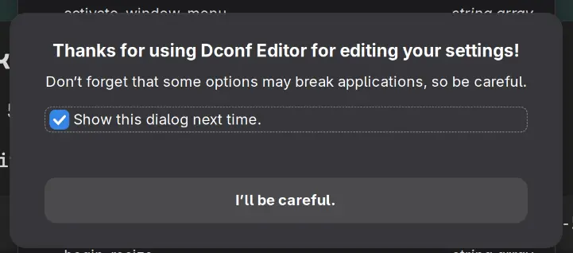
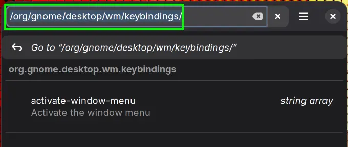
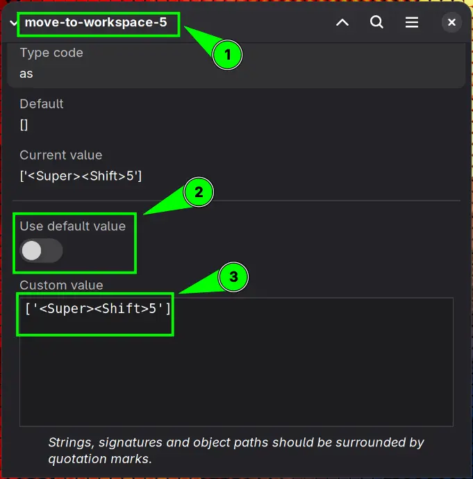

From GNOME settings GUI, you can only add keyboard shortcuts for up to 4 workspaces.

If your workflow depends on more than 4 workspaces, you cannot add them via `gnome-control-center` aka **GNOME Settings** GUI.

There are two methods to add shortcuts for up-to 12 workspaces.

## dconf Editor

Open the `dconf Editor`, accept the risk associated with changing default settings via `dconf Editor`



Then navigate to:
<button>org</button> > <button>gnome</button> ><button>desktop</button> > <button>wm</button> > <button>keybindings</button>

Or click on `search` 🔎 icon, and put this in the search bar:

```text{linenos=false}
/org/gnome/desktop/wm/keybindings/
```



1. Click on `switch-to-workspace-5` (not available via `gnome-control-center`)

2. Turn off `Use default value`
3. Add your `Custom value` for key binding, i.e. <kbd>Super</kbd> + <kbd>5</kbd>
```text{linenos=false}
['<Super><Shift>5']
```



Then go back to `/org/gnome/desktop/wm/keybindings/` and click on `move-to-workspace-5`.

Using the previous steps, add this shortcut <kbd>Super</kbd> + <kbd>Shift</kbd> + <kbd>5</kbd> (To move focused app to workspace-5) to `Custom value` field.

```text{linenos=false}
['<Super><Shift>5']
```

## Terminal: Using `gsettings` (Recommended)

The more direct and easy method is using `gsettings` via terminal. This command is available on GNOME desktop by default.

- To assign a shortcut to switch to workspace#6 (Just an example you select any number up-to 12)

```console{linos=false}
gsettings set  org.gnome.desktop.wm.keybindings switch-to-workspace-6 "['<Super>6']"
```

Then you can use <kbd>Super</kbd> +<kbd>6</kbd> to switch to workspace#6.

- If you also want a shortcut to send apps to workspace#6, run in the terminal

```console{linenos=false}
gsettings set  org.gnome.desktop.wm.keybindings move-to-workspace-6 "['<Super><Shift>6']"
```

Now you can use <kbd>Super</kbd> + <kbd>Shift</kbd> + <kbd>6</kbd> key binding to move a focused app to workspace#6.

> [!TIP]''
> Repeat the same process for assigning shortcuts to more workspaces by substituting workspace numbers.