It's a part of multi blogs [series](/tags/coreutils-series/), which will explain how to use GNU Core Utilities, useful for novice and professionals alike. GNU Coreutils are file, shell, and text manipulation commands/tools which are available on every GNU based Linux system.

In today's blog, you will learn about Coreutils that are used in everyday file operations. Let's begin:

> [!NOTE]
> I will only explain those functions and commands which are in my opinion add value to everyday usage and management of the Linux Systems.

## `ls` --- list directory contents

To show the contents of a directory:
```console{linenos=false}
ls
```
- This command will list only non-hidden directories and files.

List subdirectories and their content recursively:
```console{linenos=false}
ls -R
```
- `--recursive`/`-R` Useful for investigation of unknown directories and their content

List entries by column (default):
```console{linenos=false}
ls -C
```
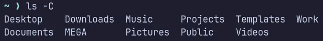

List entries by rows instead of default columns:
```console{linenos=false}
ls -x
```
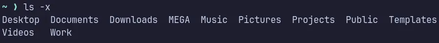

List one file per line:
```console{linenos=false}
ls -1
```

### Show Hidden Entries

To list entries started with `.` (hidden):
```console{linenos=false}
ls -a
```
- `--all`/`-a` lists hidden files and directories

The flag `--all` also shows `.` And `..` Which represent current directory and parent directory respectively. To hide those:
```console{linenos=false}
ls -A
```
-`--almost-all`/`-A` It doesn't list implied `.` and `..`

### Show Long Listings

To show long listing format:
```console{linenos=false}
ls -l
```
- `-l` Shows permissions, owner, group, size and timestamps, along with the entries

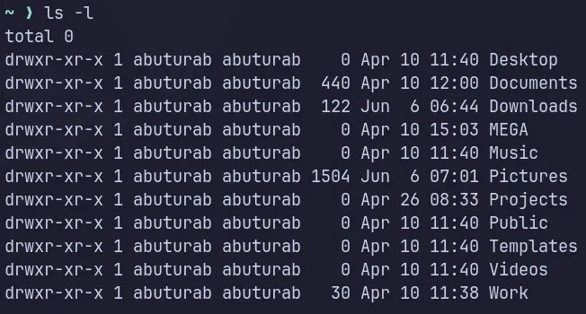

To omit group information from long listing format, rest is the same as `-l` flag listing:
```console{linenos=false}
ls -o
```
- `-o`/`-lG`/`-l --no-group` Exclude group information from long listing format

Owner can be omitted as:
```console{linenos=false}
ls -g
```

Prints the author information of each file, when used with `-l`:
```console{linenos=false}
ls -l --author
```
- It's useful on multi-user systems to find out of who is the owner of the particular file lingering around.

Print C-Style backslash character (\n, \t, \r etc.) for non-printable and special characters.
```console{linenos=false}
ls -l -b
```
- `--escape`/`-b` flag prints C-Style backslash characters

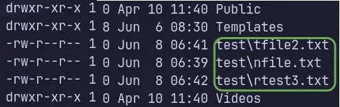
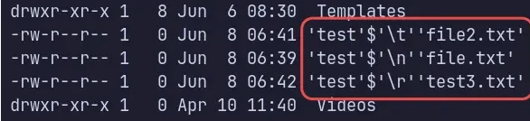

C-Style character map:

| Escape |      Meaning      |
|:------:|:-----------------:|
|   \n   |      Newline      |
|   \t   |        Tab        |
|   \r   |  Carriage Return  |
|  \\\   | Literal Backslash |
|   \0   |  Null character   |
|  \040  |       Space       |

### Symbolic Links Listing

Follow the symbolic link listed on the command line:
```console{linenos=false}
ls -l -H <SYMLINK>
```
- The flags `--dereference-command-line` and `-H` serve the same purpose.
- Only follow the symbolic links if file/DIR is given in CLI argument

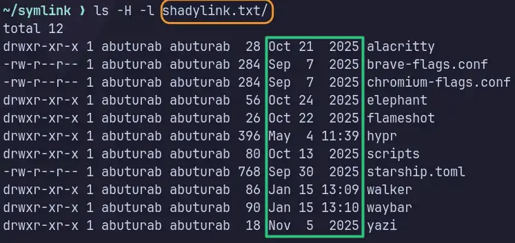


Follow the link and show information for the file itself not the symbolic link. This means `ls` will follow the link and display information about the target file or directory, not the link itself.
```console{linenos=false}
ls -l -L
```
- The flags `--dereference` and `-L` are the same.


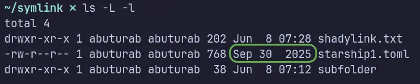

### Print Size Information

Print allocated size of each file in blocks:
```console{linenos=false}
ls -s
```
- `--size`/`-s` shows the file size in bytes (blocks) which are 1024 bytes (1 KiB) by default.

You can mention the specific unit yourself:
```console{linenos=false}
ls -s --block-size=M
```
- K, M, G etc. are the powers of 1024(binary) or prefixes like KiB=K, MiB=M, GiB=G and so on.
- KB, MB, GB etc. are the multiples of 1000 (decimal)

To show human-readable size (binary) with flags like `-s` and `-l`:
```console{linenos=false}
ls -sh
```
- `--human-readable`/`-h` are the same

The flag `--si` prints the size information like `-h` but in decimal (powers of 1000):
```console{linenos=false}
ls --si -l
```
- The `--si` flag should be used with either `-s` or `-l` flag

### Sorting Order

To list directories before files:
```console{linenos=false}
ls --show-directories-first
```
- It can be combined with `-l` `-a` flags

Reverse order while sorting:
```console{linenos=false}
ls -r
```
- `--reverse`/`-r` Reverse the current order of listings

Sort by file size:
```console{linenos=false}
ls -S
```
- `--size`/`-S` Sort the largest sized file first, doesn't help with directories

To sort by time:
```console{linenos=false}
ls -t
```
- `-t` Sort the newest modified file first
> [!TIP] Tip
> The sort by `-t` and `-t` with `--time=mtime` give the same results. The `-t` alone defaults to the last modification time.

Sort by time, based on birth time (creation time):
```console{linenos=false}
ls -t --time=birth
```
- Combining with `-l` shows the creation/birth time
- It will print newly created item first, flag `-r` can show the oldest birth first by reversing the order.

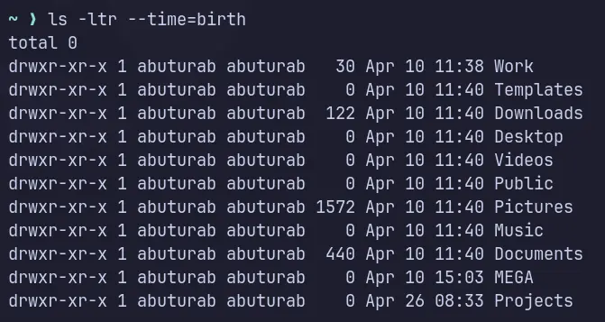

Sorting based on when a file is last accessed(no modification or write):
```console{linenos=false}
ls -lt --time=atime
```
- `-u` The shorter version of `--time=atime`

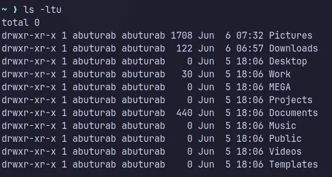

> [!CAUTION] INFO
> On modern Linux systems, `noatime` mount option reduces the disk I/O operation by cutting down the access time updates. While `relatime` mount option only update access metadata under certain conditions.

Sort by last metadata change time:
```console{linenos=false}
ls -lt --time=ctime
```
- The flag`--time=ctime` can be substituted to `-c`

> [!TIP]
> It records changes to ownership and permissions along with creation and edit timestamps. While `--time=mtime` only records creation and edit timestamps.

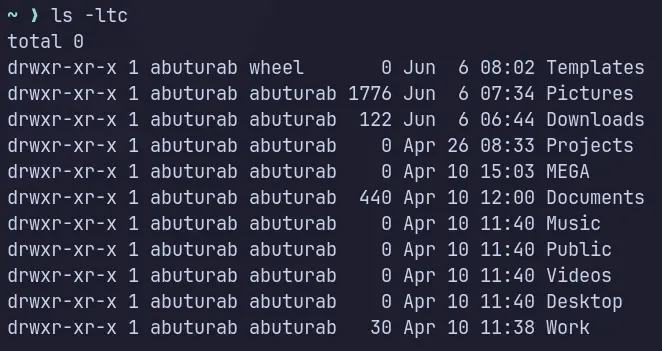

### Timestamps Long Listing

> [!NOTE]
> Timestamp information is only shown when using the long listing format with the flag `-l`, so all the below commands must be run with `-l` flag to actually see what's happening with timestamp information.

#### Timestamp Versions

You can see a different timestamp when listing with `-l` flag, which by-default shows the last modification time. You can achieve this without `-t` command which by-default sorts entries based on `--time=WORD` command. 

Let's list a last access time stamp which the files are last accessed by an editor, `cat`, or commands without modifying the content:
```console{linenos=false}
ls -l --time=atime
```
- The short version is `-u`

Print the last metadata change timestamp:
```console{linenos=false}
ls -l --time=ctime
```
- The flags `--time=ctime` and `-c` serve the same purpose


#### Timestamp Display Properties

By default, long listing shows the `locale` timestamp:
```console{linenos=false}
ls -l --time-style=locale
```
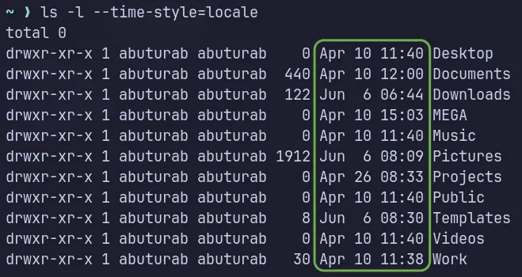

To show full date and time with minutes precision:
```console{linenos=false}
ls -l --time-style=long-iso
```
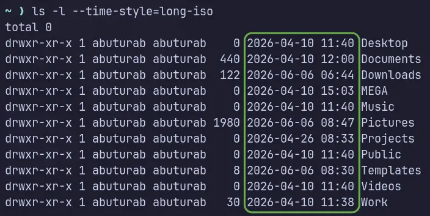

To list timestamps with nanosecond precision and time zone
```console{linenos=false}
ls -l --time-style=full-iso
```
-  The flags `--time-style=full-iso` and`--full-time` serve the same purpose

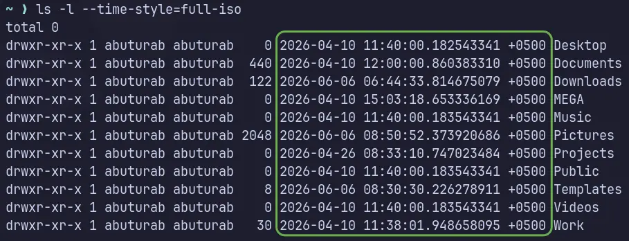

### IGNORE Entries via Pattern Matching

Basic ignore via `-B` flag:
```console{linenos=false}
ls -B
```
- `--ignore-backups`/`-B` don't list implied entries ending with `~`
- The `~` at the end of the file is used by different text editors and other programs to store backups of files.

Advance pattern matching:
```console{linenos=false}
ls --ignore=PATTERN
```
- `-I PATTERN`/`--ignore=PATTERN` are the same

Basic Glob Patterns:

| Pattern |        Matches        |
|:-------:|:---------------------:|
|   \*    | Anything (any length) |
|    ?    | Any single character  |
| \[abc]  |     One of these      |
| \*.txt  |    Any `.txt` file    |

Hide all `.text` files:
```console{linenos=false}
ls -I "*.txt"
```

Hide all JSON backup files:
```console{linenos=false}
ls --ignore="*.json~"
```

Hide all file1.txt, file2.txt and so on:
```console{linenos=false}
ls --ignore="file?.txt"
```

Hide anything that has `oct` in their name anywhere:
```console{linenos=false}
ls --ignore="*oct*"
```
- It's case-sensitive

### `ls` --- Exit Codes

Following are some useful exit codes:

<kbd>0</kbd> OK

<kbd>1</kbd> There is some minor problem, like subdirectory is not accessible etc.

<kbd>2</kbd> Serious issue, i.e., cannot access CLI argument

> [!NOTE]
> Modern Linux systems might just show the issue descriptively instead of an error code to simplify the troubleshooting process. To show an error code:
> `ls [argument] ; echo $?`

### Useful Tips

Show colored output:
```console{linenos=false}
ls --color=auto
```
- Shows different color for different entry types
- Can be combined with other commands

Show version information and exit:
```console{linenos=false}
ls --version
```

Distinguish between directories and files:
```console{linenos=false}
ls -F
```
- Shows `/` with DIRs

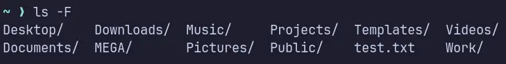

Show help information:
```console{linenos=false}
ls --help
```

See manual pages:
```console{linenos=false}
man ls
```

Print index number of each file
```console{linenos=false}
ls -i
```
- `--inode`/`-i` print the index number

## References

- [GNU Coreutils](https://www.gnu.org/software/coreutils/manual/coreutils.html#ls-invocation) --- GNU Official Manual
- [GNU Core Utilities](https://en.wikipedia.org/wiki/GNU_Core_Utilities) --- Wikipedia
- `man <command name>` --- The source for commands and the most flags used here taken for manual pages bundled with the COREUTILS package installed on Linux