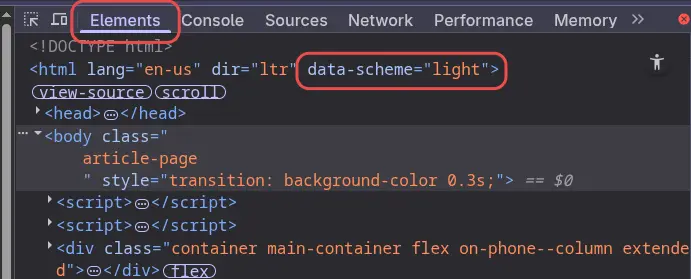

The hero/avatar image on the home page can show different images with different themes. You might need it if your image is only suitable for light theme, and you want to use different image for dark theme.

## Hugo Configuration File

First enable your avatar in the Hugo config. I will use `hugo-theme-stack` as a reference point.

> [!NOTE] Info
> Check your themes docs to know what's the proper config for your avatar/hero image, and put that in your Hugo configuration file.

In case of `hugo.yaml`:
```yaml{linenos=false}
params:
    sidebar:
        emoji: 🇵🇰
        subtitle: "Plug In. Geek Out."
        avatar: "img/avatar-dark.webp"

```

For `hugo.toml`:
```toml{linenos=false}
[params.sidebar]
emoji = 🇵🇰
subtitle = "Plug In. Geek Out."
avatar = "img/avatar-dark.webp"
```


Put your avatar for Hugo config in the `/assets/img` directory. Here I set the one which I want to use if something breaks in my `custom.scss` rules and this will act as a fallback image.

## Custom SCSS Rules

> [!NOTE] Info
> These custom rules might not work for your Hugo theme, due to theme key mismatch. The `hugo-theme-stack` uses `data-scheme` key for tracking theme changes. Other Hugo themes might use different keys for this.
> 

Now let's move towards creating some custom rules to use different images for light and dark themes.

Let's create an `avatar` directory:
```bash{linenos=false}
mkdir static/avatar #Run this inside your main hugo directory
```

Copy your `avatar-light.webp` and `avatar-dark.webp` files inside the `avatar/` directory.

> [!TIP] The `.webp` image format is more suitable for websites, due to its small size and better delivery optimizations. See [ImageMagick](/imagemagick-tips-and-tricks/) guide for conversion.

Let's create another directory for SCSS rules:
```bash{linenos=false}
mkdir assets/scss/
```

Inside `scss/` create a `custom.scss` file. Add following lines to this file:
```scss
.site-avatar img {
  content: url('/avatar/avatar-light.webp');
}

[data-scheme="dark"] .site-avatar img {
  content: url('/avatar/avatar-dark.webp');
}
```

Now you're good to go. You will see different hero/avatar images for light/dark themes.