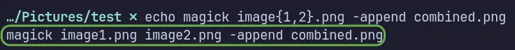

ImageMagick is a free and open-source set of tools for displaying, converting, editing raster image (grid of pixels, resolution dependent) and vector image (mathematical curves and shapes, resolution independent) files. It's a Swiss army knife of image manipulation and editing via command-line interface.

> [!INFO] ''
> IM is an extremely advanced tool with numerous functions and features. This blog will be updated based on my usage and familiarity of IM over time.

## Conversion between Image Formats

You can easily convert between image formats
```term{linenos=false}
magick image.png image.jpg
```
It will convert the `.png` image to `.jpg` format.

OR
```term{linenos=false}
magick image.png image.webp
```
It will convert the `.png` to `.webp` image format, suitable for Web usage.

The `.WEBP` images are standard on the web, due to their small size and lazy loading features. To get instant loading of images on the web, you can use `-quality` attribute to further reduce the size of `.webp` images without significant quality degradation.
```term{linenos=false}
magick -quality 70 image.png image.webp
```

To batch convert multiple `.PNGs` in the current working directory:
```bash{linenos=false}
for img in *.png; do magick "$img" -quality 70 "${img%.png}.webp"; done
```

Before running the scriptlet, you can see with `echo` command, what will happen when the scriptlet is run:
```bash{linenos=false}
for img in *.png
do 
echo magick "$img" -quality 70 "${img%.png}.webp"
done
```


- `for img in *.png` Loop through each PNG file in the current directory, store the filename in a variable called `img`
- `do` Start of the loop
- `"$img"` Holds the current filename during each loop iteration, the double quotes `""` makes sure, space and other characters in the filenames are handled correctly.
- `"${img%.png}.webp"` It replaces the `.png` in the **filename.png** with `.webp`, the operator `%` removes from the right (in our case replaces image extension names).
- `done` Ends the loop and repeats for the next PNG file.
- The semicolon `;` acts as a command terminator, `;` also separates the loop declaration from the `do`, it's a syntax requirement when `do` is written immediately after. New line can act as a command terminator too, when not writing the scriptlet on a single line.
- Test scriptlet is written without semicolons as new lines are acting as command terminator.


## Combine Images

You can combine two images either horizontally or vertically, by using.
```term{linenos=false}
magick image1.png image2.png -append combined.png
```
Image1 and Image2 will be combined vertically, first on the top and second in the bottom. To combine them horizontally replace `-append` with `+append`.

The short form:
```term{linenos=false}
magick image{1,2}.png -append combined.png
```

You can use `image{1..4}.png`, which expands to image1, image2, image3 and image4.

Before running above command, you can add `echo` in the start to see how braces will be expanded without executing it.
```term{linenos=false}
echo magick image{1,2}.png -append combined.png
```


## Resize an Image

To resize an image:
```term{linenos=false}
magick input_image -resize WIDTHxHEIGHT output_image
```

You can just use `WIDTHx`, the height will be adjusted accordingly.

You can also use percentage as a parameter:
```term{linenos=false}
magick input_image -resize 70% output_image
```
It will resize the image to 70% of its original size.

## Create a GIF

Create a `.gif` from all the PNGs in the current directory:
```term{linenos=false}
magick *.png output.gif
```

With `-loop`, you can set how many times, the GIF should loop through before stopping.
```
magick *.png -loop 5 output.gif
```

You can set `-delay` for animation too.

## Rotate an Image

To rotate an image:
```term{linenos=false}
magick input_image -rotate 90 output_image
```
It will rotate the image clockwise by 90 degrees.

To rotate counterclockwise by 90 degrees:
```term{linenos=false}
magick input_image -rotate -90 output_image
```

## Add a Border to an Image

To set a border around an image:
```term{linenos=false}
magick input_image -bordercolor COLORNAME -border WIDTHxHEIGHT output_image
```

To add a border of 5 pixels around the edge of an image, with border color purple:
```term{linenos=false}
magick input_image -bordercolor purple -border 5x5 output_image
```

## Grayscale Effect on an Image

To add a grayscale effect to an image:
```term{linenos=false}
magick input_image -colorspace gray output_image
```

## Strip EXIF Data from an Image

To strip all EXIT/metadata from an image:
```term{linenos=false}
magick input_image -strip output_private_image
```
This operation will remove all the EXIF data, and also reduces the size of an image significantly.

---
## References

- [Examples of ImageMagick Usage](https://usage.imagemagick.org/) --- The In-depth Official Documentation
- [ImageMagick](https://wiki.archlinux.org/title/ImageMagick) --- Tips & Tricks from ArchWiki
- [Fred's ImageMagick Scripts](http://www.fmwconcepts.com/imagemagick/index.php) --- Useful ImageMagick Scripts
- [Unlock the Power of ImageMagick](https://geeksta.net/geeklog/imagemagick-tutorial/) --- (An old IM Version Beginner)
- [ImageMagick Guide](https://d00k.net/wiki/linux/imagemagick/) --- (Adopt the Command for Newer IM Version)