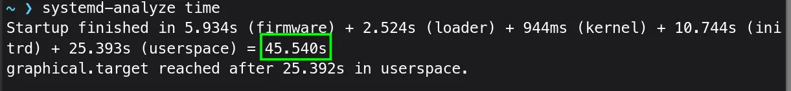
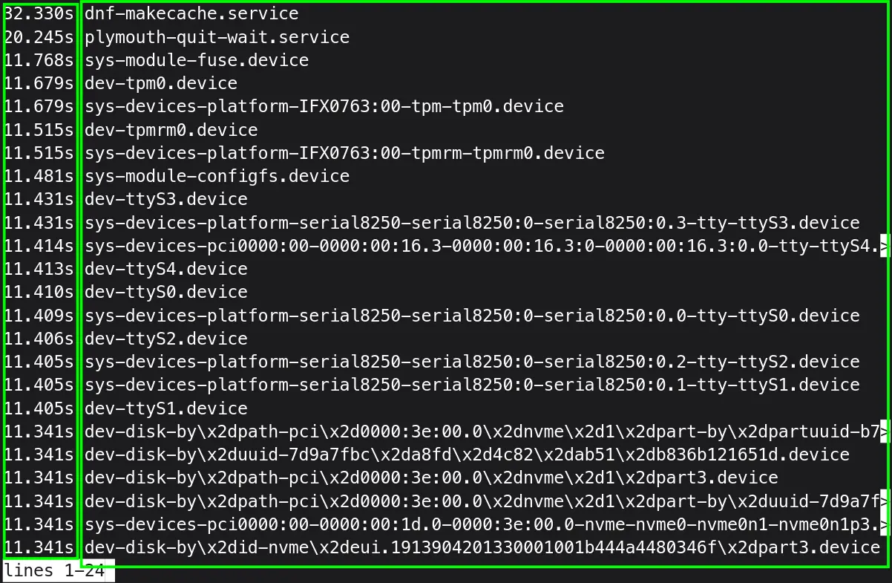
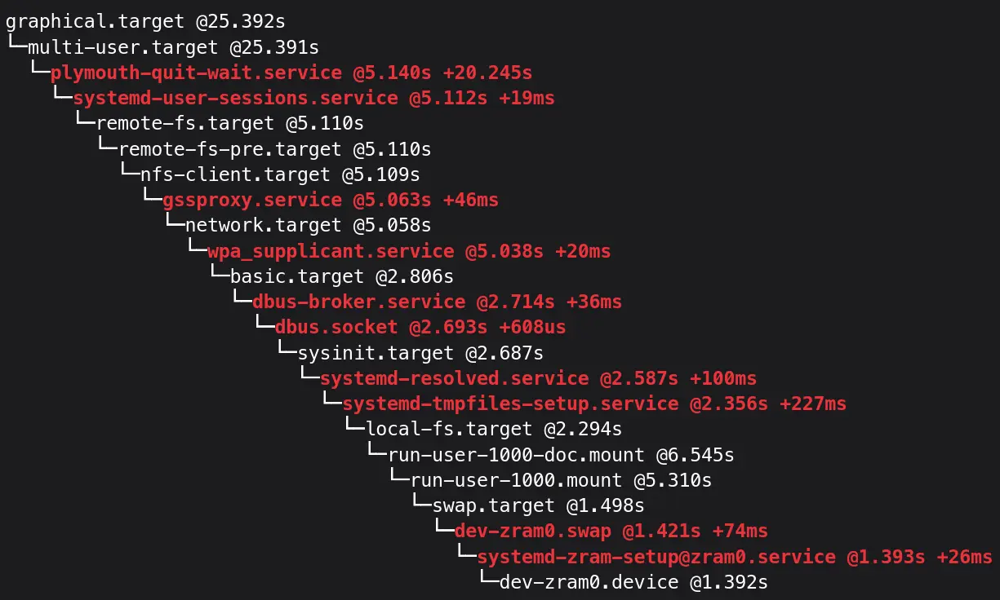
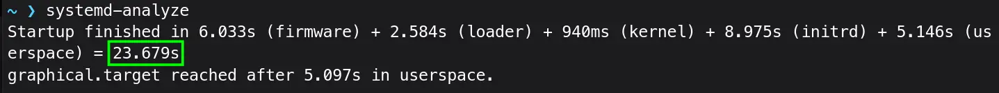

When you push power button, and your computer takes ages to boot-up, you wait and wait, but Welcome screen didn't come up. Didn't we come to Linux for faster experience everywhere?(Pun Intended!).

Let's investigate and speed up our startup time.

Run this in the terminal:
```bash{linenos=false}
systemd-analyze time #running without `time` works the same
```


- `systemd-analyze` It can be used to determine system boot-up performance
- `time` Shows how long a boot take

My computer took **45.5s** in total to reach the Welcome screen. It is already quite fast for an FDE (Full Disk Encryption) system, but we can definitely do better!

Let's see, which units take how much time to reach the userspace.

```bash{linenos=false}
systemd-analyze blame
```

- `blame` Prints a list of all running units ordered by the time they took to initialize

My computer shows number of units with how much time each took to initialize. (Scroll Down to see all the units)


But this command can be misleading at best in determining how much time each unit took for initialization. As, one unit might wait until another unit has started.

Let's print only time-critical chain of units:
```bash{linenos=false}
systemd-analyze critical-chain #you can use particular unit name after critical-chain too
```

- The time when unit became active or started is printed after the **"@"** character.
- The time the unit took to start is printed after the **"+"** character.


From your output, research online about every unit, and what they do. Are they really critical for your workflow? Do they really need to be started on boot? Then go on, and disable non-critical services which add up to boot-up times.

The only non-critical service I see is `plymouth-quit-wait.service`, which took over 20s. But it could be [deceptive](https://askubuntu.com/questions/1119167/slow-boot-issue-due-to-plymouth-quit-wait-service-ubuntu-18-04). But Sometimes It can cause the [hold up](https://access.redhat.com/discussions/5f92a475-e051-459c-a2d8-9563102e0a56) too.

To confirm if it's holding up any service I run:
```
systemctl list-dependencies plymouth-quit-wait.service
```

You should only get:
```console{linenos=false}
plymouth-quit-wait.service
● └─multi-user.target
●   └─graphical.target
```

If you want, you can mask this service, which makes it impossible for any service to start it.
```console{linenos=false}
sudo systemctl mask plymouth-quit-wait.service
```

> [!Warning] ''
> You might see graphical glitches, though I myself didn't experience any. There might be no significant if any boot-up improvement to observe.

When I ran `systemd-analyze blame` command, and went through all the units. I could see `NetworkManager-wait-online.service` taking up about 5s to load. Let's confirm it:

> [!TIP] ''
> Press <kbd>/</kbd> and type anything to search through running units for `systemd-analyze blame` command.

```console{linenos=false}
systemd-analyze critical-chain NetworkManager-wait-online.service
```

It did take 5.4s to load.


I don't need this, as I don't have any network drives which need to be mounted on boot up, so I can safely disable it:
```console{linenos=false}
sudo systemctl disable NetworkManager-wait-online.service
```

`ModemManager.service` is another one, though it takes only 1/4 of a second, but I don't need it either. It is used for Mobile Broadband, which I don't use anyway. So disabling it, is a good idea, for security point of view too.

```console{linenos=false}
systemd-analyze critical-chain ModemManager.service
```


To disable it:
```console{linenos=false}
sudo systemctl disable --now ModemManager.service
```

Let's reboot and run `systemd-analyze` to see, how much startup time has improved.


The net gain could be just a few seconds. As in my case, `plymouth-quit-wait.service` wasn't really slowing down a boot process. Happy Tinkering!