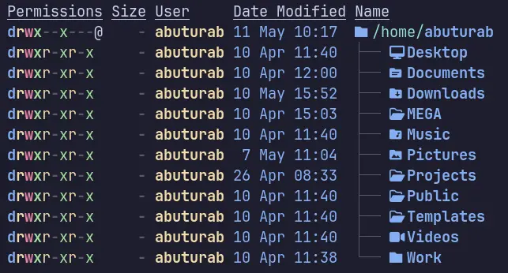
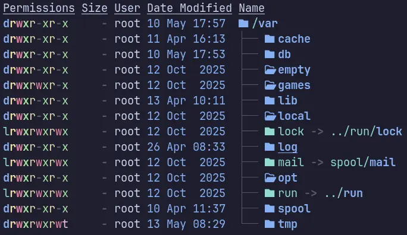

Everything on the Linux system is a file, yes even the directories we are going to discuss here. Let's learn some basics of the Linux Filesystem before moving forward.

 **Directory:** A special sort of file that holds links to other files. Folder is also an interchangeable name for Directory.

**File:** A self-contained piece information available to the OS and other programs. They are owned by the user who creates them.

**Filesystem:** It refers to the filesystem hierarchy, in which the files are organized and manager by the OS. OR it can refer to the type of format that is used to store files on a block device such as EXT4, XFS, ZFS, BTRFS etc.

**Link:** When a file points to another file or directory, it is called a symbolic link. While symbolic link acts as a shortcut to the linked file or directory, a hard link is an exact reference to the file data on the disk (inode). Basically, a hard link is another name for the same file, and doesn't work on directories.

[](https://www.linuxfoundation.org/hubfs/Imported_Blog_Media/standard-unix-filesystem-hierarchy-1500x826.png)

> [!TIP] 
> You have learnt only about the few basic terms those are helpful to understand the Linux directory structure. The detailed guide will be covered in some other blog or watch [this video](https://www.youtube.com/watch?v=p9lCbFq8IPo).

## Root Directory `/`

A Root Directory `/` sits at the top of a Linux Filesystem hierarchy. It contains boot, configuration files, system binaries and users' home directories etc.

## Binaries `/bin`

The `/bin` directory contains essential user accessible command binaries like `ls`, `cat`, `rm`, `grep`, `rfkill` etc. This directory is usually symlinked to `/usr/bin`. These commands are available to all the users on the system.

## Boot Directory `/boot`

It contains all the files necessary for system boot up including Linux Kernel and bootloader configuration files. You can install more than one Kernel inside your `/boot` in case one fails.


## Devices `/dev`

## System Configurations `/etc`

All the configuration files for operating system, programs, applications, and services live in the `/etc` directory. These configuration files are only editable via root. They apply system-wide for all users.

## User Home `/home`

The `/home/<username>` is the home to all the local users available on the system. Every local user has its home directory under `/home` which further contains XDG user directories. 



There are also hidden directories like `.local`, `.config`, `.cache` etc. The applications running as user, also store their configuration files in the `XDG_CONFIG_HOME` or in a hidden directory at `/home/<username>/.`. The `XDG_CONFIG_HOME` is located at `~/.config`.

Like many others, lib directories are also symlinked to `/usr/lib` and `/usr/lib64` directories to consolidate directory structure on the modern Linux Systems.

## Shared Libraries `/lib`

It contains shared libraries of the binaries present in the `/bin` `/sbin` directories. Depending on the system, `lib` and `lib64` for 32-bit and 64-bit respectively for shared libraries may also be present.

## Removable Media `/media`

When you plugged in a USB device, if it's autoconfigured to mount, it will mount at `/media`. 

> [!NOTE] Info
> The USB devices on Arch Linux, are mounted to `/run/media/$USER` by `udisk`.

## Manual Mount `/mnt`

You can manually mount Hard Disk Drives, Partitions and other media to `/mnt`. It's mostly a temporary mount point, which maybe used during Linux chroot and other filesystem operations. 

Let's manually mount a USB stick, to `/mnt`, first create a mount point:
```bash{linenos=false}
sudo mkdir /mnt/usb_stick
```

Identity the device name for our USB:
```bash{linenos=false}
lsblk
```

Our USB is called `sda` and my USB has two partitions, the usable one with 29 GB of size is `sda1`
```bash{linenos=false}
sudo mount /dev/sda1 /mnt/usb_stick
```

To unmount:
```bash{linenos=false}
sudo umount /mnt/usb_stick
```

## Optional Software `/opt`

The software which doesn't fit in the `/bin` or `/sbin` directories resides here, like proprietary applications, or applications downloaded from sources other than the OS repos.

In the Enterprise environment, there are many custom programs are used, which are installed inside the `/opt` directory.

## Processes `/proc`

## Root Home Directory `/root`

The `/root` is a home for root user, a superuser with administrative privileges. It contains all the files, directories, and configuration related to the root user, i.e., root `.local`, `.bashrc` etc.


## Runtime Data `/run`

## System Binaries `/sbin`

The `/sbin` directory contains all the necessary programs needed for system administration. It contains programs like `fsck`, `ip`, `traceroute` etc. The `/sbin` directory on modern Linux systems is symlinked to `/usr/sbin`

> [!NOTE] Info
> On Arch Linux, both `/bin` and `/sbin` are symlinked to the `/usr/bin` which essentially means, they contain exactly the same binaries.

## Services `/srv`

## System `/sys`

## Temporary Files `/tmp`

All the temporary system files reside in the `/tmp` directory. It usually wipes out on system reboot. System services and programs might write data to this directory on temporary bases which they may need later.

You can also save your temporary data in there as well. I usually use it for cloning git repos, which I need to quickly refer something, and won't mind it being deleted on the reboot.

## Unix System Resources `/usr`

It contains the majority of system files, libraries, and binaries. It also contains the documentation for applications installed on the system, as well as the pre-installed system binaries and programs. Furthermore, it contains subdirectories too.


## Variable Data `/var`

When a Linux System is running, there is a variable data like system logs, spool files (tasks waiting to be processed), and temporary e-mail files etc., stored in the `/var` directory. This data is variable in nature and constantly changing.

There is also a `/var/tmp` directory which contains temporary data which needs to be preserved on the reboot.



## References

- [Linux Directories Explained in 100 Seconds](https://www.youtube.com/watch?v=42iQKuQodW4) --- Fireship
- [Learning The Linux File System 2025](https://www.youtube.com/watch?v=p9lCbFq8IPo) --- Joe Collins (EzeeLinux)
- [The Linux File System explained in 1,233 seconds // Linux for Hackers // EP 2](https://www.youtube.com/watch?v=A3G-3hp88mo) --- NetworkChuck
- [Linux File System Structure Explained: From / to /usr | Linux Basics](https://www.youtube.com/watch?v=ISJ44S5sZu8) --- WhiteboardDoodles