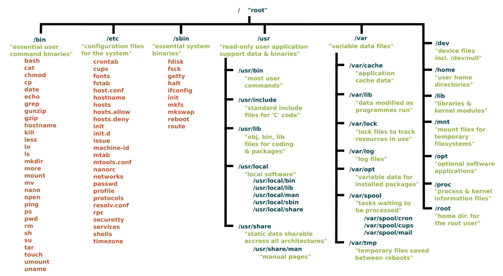
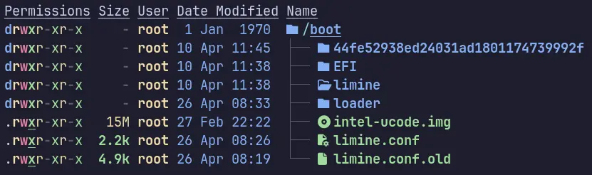
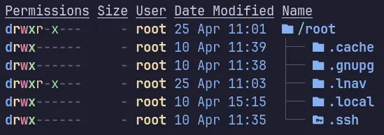
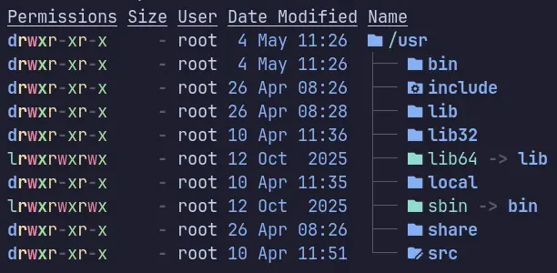

Everything on the Linux system is a file, yes even the directories we are going to discuss here. Let's learn some basics of the Linux Filesystem before moving forward.

 **Directory:** A special sort of file that holds links to other files. Folder is also an interchangeable name for Directory.

**File:** A self-contained piece information available to the OS and other programs. They are owned by the user who creates them.

**Filesystem:** It refers to the filesystem hierarchy, in which the files are organized and manager by the OS. OR it can refer to the type of format that is used to store files on a block device such as EXT4, XFS, ZFS, BTRFS etc.

**Link:** When a file points to another file or directory, it is called a symbolic link. While symbolic link acts as a shortcut to the linked file or directory, a hard link is an exact reference to the file data on the disk (inode). Basically, a hard link is another name for the same file, and doesn't work on directories.

> [!TIP] 
> You have learnt only about the few basic terms those are helpful to understand the Linux directory structure. The detailed guide will be covered in some other blog or watch [this video](https://www.youtube.com/watch?v=p9lCbFq8IPo).

## Root Directory `/`

A Root Directory `/` sits at the top of a Linux Filesystem hierarchy. It contains boot, configuration files, system binaries and users' home directories etc.

## Binaries `/bin`

## Boot Directory `/boot`

It contains all the files necessary for system boot up including Linux Kernel and bootloader configuration files. You can install more than one Kernel inside your `/boot` in case one fails.

## Devices `/dev`

## System Configurations `/etc`

## User Home `/home`

## Shared Libraries `/lib`

## Removable Media `/media`

## Manual Mount `/mnt`

## Optional Software `/opt`

## Processes `/proc`

## Root Home Directory `/root`

The `/root` is a home for root user, a superuser with administrative privileges. It contains all the files, directories, and configuration related to the root user, i.e., root `.local`, `.bashrc` etc.

## Runtime Data `/run`

## System Binaries `/sbin`

## Services `/srv`

## System `/sys`

## Temporary Files `/tmp`

## Unix System Resources `/usr`

It contains the majority of system files, libraries, and binaries. It also contains the documentation for applications installed on the system, as well as the pre-installed system binaries and programs. Furthermore, it contains subdirectories too.

## Variable Data `/var`

## References

- [Linux Directories Explained in 100 Seconds](https://www.youtube.com/watch?v=42iQKuQodW4) --- Fireship
- [Learning The Linux File System 2025](https://www.youtube.com/watch?v=p9lCbFq8IPo) --- Joe Collins (EzeeLinux)
- [The Linux File System explained in 1,233 seconds // Linux for Hackers // EP 2](https://www.youtube.com/watch?v=A3G-3hp88mo) --- NetworkChuck
- [Linux File System Structure Explained: From / to /usr | Linux Basics](https://www.youtube.com/watch?v=ISJ44S5sZu8) --- WhiteboardDoodles