There are various methods and tools to manage your dotfiles on your Linux/Unix system. But we will discuss only two of them:
1. `GNU Stow` A Beginner friendly tool
2. `ln -s` Simple but effective without using any 3<sup>rd</sup> Party tool

## **GNU Stow**

### Installation

Let's install `stow` first, on Fedora:
```console{linenos=false}
sudo dnf in stow
```

On Ubuntu and based distros:
```console{linenos=false}
sudo apt install stow
```

On Archlinux:
```console{linenos=false}
sudo pacman -S stow
```

### Usage

Make dotfiles directory in the $HOME directory:
```console{linenos=false}
mkdir $HOME/mydots
```

The `mydots` directory will be created in your $HOME.

Initialize the empty git repository:
```console{linenos=false}
git init
```

Now `mydots` will be initialized as a git repository. You can use `git` version control your dotfiles.

#### Basic Directory Structure
> [!TIP] ''
> You can keep your dotfiles repo inside your `git`/`github` repos directory too, later I'll explain how to do that, instead of keeping your dotfiles in the $HOME directory. You don't even need to follow the standard Stow DIR structure either.

To save `alacritty` config inside the `mydots` directory, you need to make sure:
- Name the parent directory as `alacritty`
- As `alacritty` config resides in the `~/.config/alacritty` dir, we need to make two directories inside the parent `alacritty` directory, which are `.config` and inside it `alacritty` (That's how `stow` knows where to put the configs for each application)

```console{linenos=false}
mkdir -p alacritty/.config/alacritty
```
- The `-p` flag makes sure no error if existing, make parent directories as needed.

The `~/mydots/alacritty/.config/alacritty` dir will be created. My `mydots` directory was completely empty, so `-p` flag made all the directories in one go.
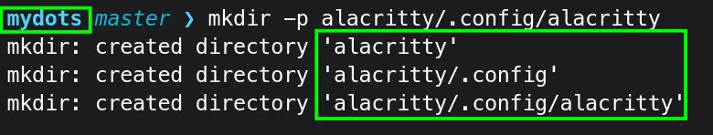

Copy your `alacritty` config in from `$HOME/.config/alacritty` directory to `mydots` repo.
```console{linenos=false}
cp $HOME/.config/alacritty/alacritty.toml $HOME/mydots/alacritty/.config/alacritty/
```
Now you have `alacritty.toml` config inside proper place in `mydots` repo.
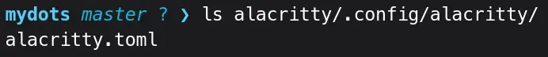

Let symbolic link your `mydots` repo `alacritty` config to your $HOME config directory.
```console{linenos=false}
stow alacritty
```
It didn't work, isn't it!
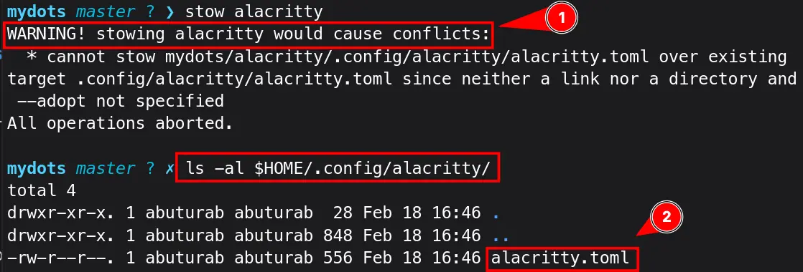

1️⃣ It showed error, as the `alacritty.toml` already exits in the `$HOME/.config/alacritty/alacritty.toml`. 

2️⃣ When we checked our `.config` directory, it shows the `alacritty.toml` as a normal file, not symlinked anywhere.

One option is to delete the `alacritty.toml` file as this:
```console{linenos=false}
rm $HOME/.config/alacritty/alacritty.toml
```

But `stow` offers a way to tackle this:
```console{linenos=false}
stow --adopt alacritty
```
- The `--adopt` flag stows the already existing plane file which is not owned by any existing stow package
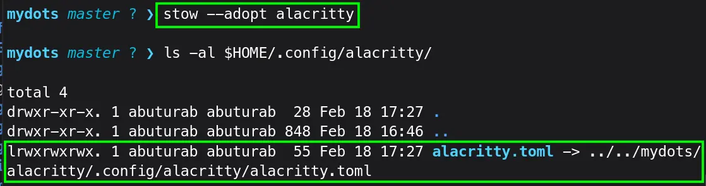

> [!INFO] ''
> When you reinstall, or `$HOME/.config/alacritty/` directory doesn't exist, running `stow alacritty` will take care of creating a `$HOME/.config/alacritty` directory and symlinking the `alacritty.toml` file.

Let's understand stowing with another example of a config file present in `$HOME` directory.

I have a `.profile` config in my `$HOME` directory. To stow, I need a `profile` directory in my `mydots` repo, and inside it, only `.profile` config file resides.

First let's create a directory inside `mydots` repo:
```console{linenos=false}
mkdir -p profile
```

After this, let's move/copy the `.profile` file inside profile's directory.

```console{linenos=false}
mv $HOME/.profile $HOME/mydots/profile/
```

Then run:
```bash{linenos=false}
stow profile #--adopt if you decide to copy instead of move
```

It will **stow** the `.profile` to `$HOME/.profile`
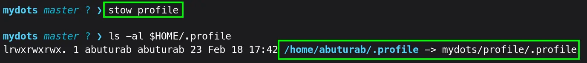


```bash
git status
git add .
git commit -m 'add my dotfiles'
```
- `status` To see untracked/modified files
- `add .` Stage all the untracked/modified files for commit
- `commit -m` Create a new commit containing current contents of the REPO
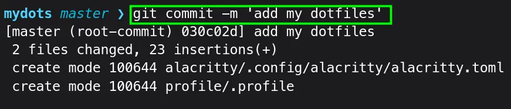

You can now upload that REPO to your GitHub/GitLab.(Out of the scope of this blog)

#### Advanced Directory Structure

If you don't want to follow the standard directory structure, `stow` offers advance flags to allow using your own directory structure.

> [!IDEA] ''
> In my opinion, deviating from [standard stow directory structure](#basic-directory-structure), defeats the purpose of `stow`, you can use it, but why not use [ln -s](#ln--s-symlinks) at this point if your only need is to manage dotfiles.

Let's transfer `mydots` directory to my `git` directory:
```console{linenos=false}
mv $HOME/mydots $HOME/Documents/git/
```

Now run (from inside `mydots` DIR):
```console{linenos=false}
stow alacritty
```

The command was successful but no `alacritty` in the `$HOME/.config`.

Run again with:
```console{linenos=false}
stow --verbose=2 alacritty
```
It was linked to `$HOME/Documents/git` directory. The `stow` command by default takes its parent DIR path as target.
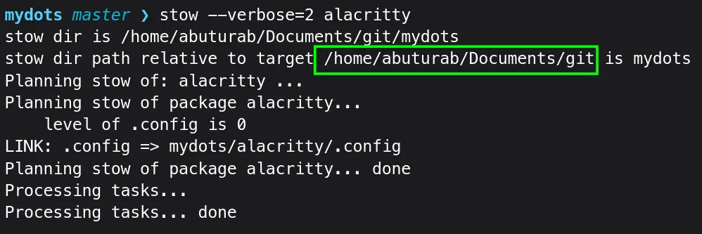

First remove the redundant symlink:
```console{linenos=false}
stow -D alacritty
```

 Let's use the command:
```console{linenos=false}
stow -t $HOME alacritty
```
- `-t DIR`/`--target=DIR` Set the target directory to DIR instead of the parent of the stow directory

**2nd example:**

To link `profile`:
```console{linenos=false}
stow -t $HOME profile
```

But what if you also don't like creating multiple directories inside your `mydots` repo for a single configuration file.

Let's go one step further, move `alacritty.toml` to `mydots/alacritty`, and delete `.config/alacritty` inside the `mydots/alacritty` directory.
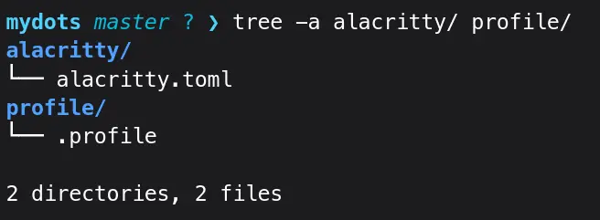
The `alacritty` directory contains only `alacritty.toml` file, no more `.config/alacritty`.

Now run:
```console{linenos=false}
stow -t $HOME alacritty
```

It will save the `alacritty.toml` file in the `$HOME` directory instead of `$HOME/.config/alacritty`.
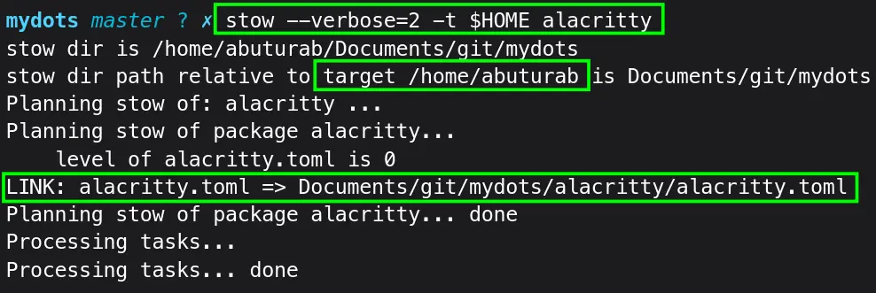

To fix this:
```console{linenos=false}
stow -t $HOME/.config/alacritty alacritty
```
- The directory `$HOME/.config/alacritty` should be created first, as stow will not handle it this way.

To avoid manually creating a directory, use this directory structure:
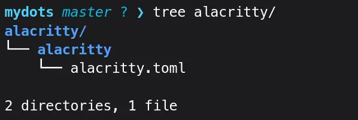
With `alacritty/alacritty/alacritty.toml` directory structure, you will need only this command:
```console{linenos=false}
stow -t $HOME/.config alacritty
```

It will link the alacritty directory normally to `$HOME/.config`.
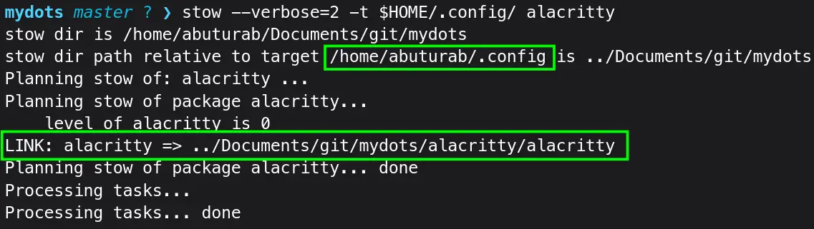

> [!DANGER] ''
> You have to use one or the other `directories` structure for configuration files, you cannot just put them directly inside `mydots` directory when using `stow`.

> [!EXPERIMENT] ''
> As you can see, advanced method got quickly out of hand and only suitable for Pro users. If you already a Pro user why not use [ln -s](#ln--s-symlinks), available on the system. But, it's your choice at the end of the day.

### Useful Commands

To **unstow** the config:
```console{linenos=false}
stow -D profile
```
- `-D`/`--delete` Unstow the config and deletes the symlinked file

To stow/restow a config, used for pruning obsolete symlinks from the target tree:
```console{linenos=false}
stow -R alacritty
```
- `-R`/`--restow` First unstow, then restow again

Show what stow command is doing:
```console{linenos=false}
stow -v alacritty
```
- `-v`/`--verbose` Show output describing what stow is doing
- `--verbose=[N]` Verbosity levels are from 0 to 5, 0 is default

It could be very helpful to troubleshoot issues, especially with `--verbose=2`.

To show some useful stow commands:
```console{linenos=false}
stow -h
```
- `-h`/`--help` Show useful stow commands syntax

You can `stow` command directly from the $HOME.
```console{linenos=false}
stow -v -t $HOME/.config -d $HOME/Documents/git/mydots alacritty
```
- `-d DIR`/`--dir=DIR` Set stow directory to "DIR" instead of default current directory
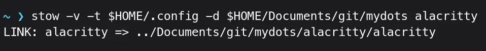
I have run it from $HOME `~/`, and it worked like a charm.

## `ln -s` Symlinks

## References

- [Stow Manual](https://www.gnu.org/software/stow/manual/stow.html) --- The official detailed manual --- I have used `man stow`, which comes bundled with the `stow` package upon installation
- [dotfiles](https://wiki.archlinux.org/title/Dotfiles) --- An ArchWiki Guide
- [My dotfiles repo](https://github.com/abuturabofficial/dotfiles) --- A mess but still do its job