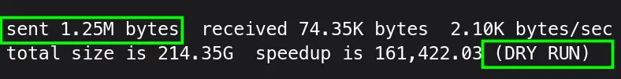
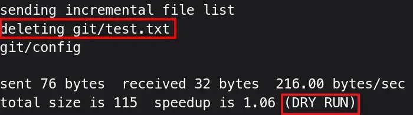

`rsync` is an amazing unidirectional sync and backup tool available for UNIX based systems. It can copy data:
- Between remote servers
- Between a local server and a remote server
- Among local PC and external storage devices.

To copy a file:
```console{linenos=false}
rsync --verbose --progress [Source] [Destination]
```
- `rsync` Sync and backup utility
- `--verbose`/`-v` Prints the names of files as they are being transferred
- `--progress` Shows real-time transfer statistics for each file

To back up a Directory
```console{linenos=false}
rsync --recursive --verbose --progress [Source] [Destination]
```
- `--recursive`/`-r` Tells `rsync` to copy DIRS recursively


I had to back up my SD card to PC. It was about 200 GB of data. I used the following command to transfer:

```console{linenos=false}
rsync -avh --progress /run/media/abuturab/Books/Books /home/abuturab/Documents/
```
- `-a`/`--archive` Preserve metadata information as well as recursive copy. It's equivalent to `-rlptgoD`
- `-h`/`--human-readable` Show output information in a human-readable format

## TIPS & Tricks

### Re-Running `rsync`

Re-running your `rsync` command, in case of an interruption will resume the copy process. In case, you have a backup on external disk, and want to refresh it. Re-run the same command, and it will populate the backup drive with newer data without re-transfer of the older data.

### Difference Between Copying `DIR` or `DIR/`

If you want to copy only the contents of a **SOURCE_DIR** to DEST_DIR without copying the source DIR itself.

```console{linenos=false}
rsync -rv SOURCE_DIR/ DEST_DIR/
```
This will only copy the content inside the **SOURCE_DIR**.

> [!INFO] ''
> Using `DIR` or `DIR/` for destination gave the same results during my testing.

If you want to copy the whole `SOURCE_DIR` to Destination.

```console{linenos=false}
rsync -rv SOURCE_DIR DEST_DIR/
```
Removing slash`/` from the **SOURCE_DIR** copies the entire source directory inside the destination folder.

### `--dry-run` Feature

To make sure, before copying anything, the command you're using works as intended use:

```console{linenos=false}
rsync --dry-run -rv SOURCE_DIR DEST_DIR/
```

When I ran it on Books folder against backup folder on PC:
```console{linenos=false}
rsync -avh --progress --dry-run /run/media/Books/Books/ /home/abuturab/Documents/Books/
```

It showed almost 1.25Mb data has changed since I last ran this command on my SD card. No actual data was transferred during dry-run.


Then running the same command without `--dry-run`, synced my SD-Card to my backup folder on PC.

### `--delete` Have Exact Copies of Two Sources

If you want the changes done to the backup folder to not carry further, you can use `--delete` with `rsync` command:
```console{linenos=false}
rsync -avh --progress --delete /run/media/Books/Books/ /home/abuturab/Documents/Books/
```
- `--delete` It will make sure, source, and destination DIRS are one-on-one copies. Any changes made on the destination DIR will be discarded.

> [!TIP] Pro Tip
> Running `--dry-run` with `--delete` will also list down all the files which are extra on the destination DIR and will be deleted when command is run without dry-run option.
> 
> Currently with `--dry-run`, it only shows, which files will be deleted.

> [!DANGER] ''
> The command `--delete` can be destructive if run on inappropriately mounted systems, so always run it first with `--dry-run` to ensure, no important data is being deleted.

### `--partial` Keep Partially Transferred Files

By default, `rsync` deletes the partially transferred file, if an interruption happens. You can use `--partial` flag to make sure rsync keeps the partially transferred file, which makes subsequent transfer of the rest of the file much faster.

### `--checksum` Safely Copy Critical Data

By default, `rsync` uses **quick check** method that checks if the file size and last modification time match between the sender and receiver.

If the data is critical, and you want to make sure, destination has exactly the bit-by-bit copy of the source, `--checksum`/`-c/` flag comes in handy. It uses 128-bit checksum for files, to make sure no even a single bit has lost during the transfer.
> [!INFO] ''
> Using `-c` will greatly reduce the transfer speeds due to computational needs of calculating checksum for each file during and after transfer.

### `--update` When Destination has Newer Files

Sometimes, you want to keep the changes, you made to the files on the destination while syncing the backup.

The flag `--update` checks if the destination file/s has a newer modification time than the source, then it will skip that file/s. You will retain the newer copies of file/s on the destination instead of replacing them with the source older file/s.

> [!INFO] ''
> The flag `--delete`, look for any files that are not present on the source DIR and deletes them, while `--update` flag checks if destination file has last modification newer than the source and keeps it.
> 
> You can safely combine them both, as they serve different purpose.

## The limitations

- It's a single-threaded tool, so the transfer rate can be limited.
- The synchronization is unidirectional. Syn happens only from Source to Destination, not other way.
- Incremental copying is great, but scanning of files changed can take good amount of time, if you have thousands of files like me.

> [!IDEA] ''
> The `rsync` is a pretty powerful utility. It has a lot of other flags and features. You can also automate taking incremental backups of your System(TimeShift has GUI which uses rsync for backups). You can check out the [reference](#references) section for more details and guides.

If you have anything to add, or I did something wrong/inefficiently, please feel free to comment down below!

## References

- [rsync](https://wiki.archlinux.org/title/Rsync), The Detailed Manual --- The ArchWiki
- [Linux File Transfers Made Easy with rsync](https://www.youtube.com/watch?v=KG78O53u8rY) --- Excellent Visual Tutorial by LearnLinuxTV
- [Using rsync for backups, because it's not shiny and new](https://www.youtube.com/watch?v=QKCIi-NxJEo) --- Video Tutorial by Veronica Explains