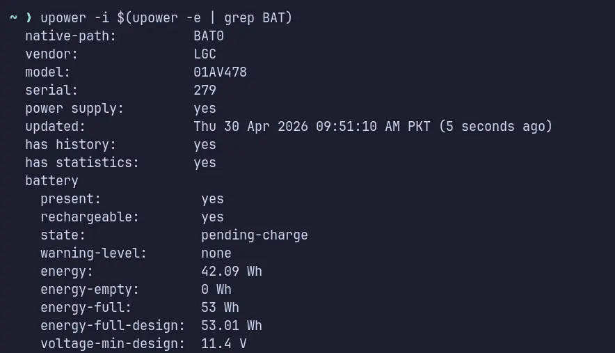

To see the health of your ThinkPad battery, and to protect its health in the long term, KDE and GNOME desktop environments allow you to graphically control charging start/stop values. But if you're on a window manager like me, or on a desktop environment which doesn't allow graphically changing these values, Linux offers built-in control commands to achieve those optimal charging start/end thresholds.

## Battery Monitoring

To see Battery stats like, charge cycles, current voltage, charge end and start thresholds:
```bash{linenos=false}
upower -i $(upower -e | grep BAT)
```


This command summarizes all the battery related stats in a single place.

The above command will summarize all the related info. But sometimes, it doesn't show the most recent info related to `charge_control_start_threshold` and `charge_control_end_threshold`. These can be used to control how much ThinkPad battery should charge, and when it should restart charging when battery percentage falls below the certain threshold.

To see when battery should stop charging:
```console{linenos=false}
cat /sys/class/power_supply/BAT0/charge_control_end_threshold
```
If it shows `100`, it means your battery will stop taking further current after this charge level is achieved. It's a default value, which doesn't protect your battery from high voltage when most of the time your ThinkPad remains plugged in.

To see when battery should restart charging:
```console{linenos=false}
cat /sys/class/power_supply/BAT0/charge_control_start_threshold
```
If it shows `0`, it typically means the charge start threshold feature is disabled.

## Charge Control

If you use your ThinkPad plugged-in most of the time, you should lower those charge end/start values to protect your battery being ruined from high voltages in the long run.

The suitable percentage to charge your battery is 80%, which provides you with enough juice in case of power outage or outdoor use, but also the voltage remains significantly lower to ruin your battery over the long run of time. 

Let's create a systemd service to control battery charging thresholds:
```console{linenos=false}
sudo nvim /etc/systemd/system/thinkpad_battery_control.service
```

Add the following lines to `thinkpad_battery_control.service` file:
```ini{lineos=false}
[Unit]
Description=Set battery charge threshold

[Service]
Type=oneshot
ExecStart=/bin/sh -c 'echo 80 > /sys/class/power_supply/BAT0/charge_control_end_threshold && echo 70 > /sys/class/power_supply/BAT0/charge_control_start_threshold'

[Install]
WantedBy=multi-user.target
```

To enable and start this service:
```console{linenos=false}
sudo systemctl enable --now thinkpad_battery_control.service
```
Now your `thinkpad_battery_control.service` is enabled, with `charge_control_end_threshold` set at `80` and `charge_control_start_threshold` set at `70`. It means your battery will stop charging at 80% and its charge level falls below 70%, it will restart charging the battery. This service will run only on boot-up once, and then will remain inactive until next reboot.

If you check your battery stats with `upower` command, it will show the old values for charging start/end thresholds, to make sure the new values are set, use the `cat` command with full path to the `sysfs` as shown above in the [Battery Monitoring](#battery-monitoring) section.

## Fully Charge Your Battery for Emergencies

If for an emergency, you need your laptop to be fully juiced up, you can temporarily bypass the charge end threshold:
```bash{linenos=false}
echo 100 | sudo tee /sys/class/power_supply/BAT0/charge_control_end_threshold
```
It will temporarily change the `charge_control_end_threshold` value to `100` percent. 

Then to immediately start charging instead of waiting for it to fall below `75` percent (It will never fall below 75% as long as you're plugged-in).
```bash{linenos=false}
echo 0 | sudo tee /sys/class/power_supply/BAT0/charge_control_start_threshold
```

When an emergency situation is over, you can simply run the `think_battery_control.service` again:
```console{linenos=false}
sudo systemctl restart thinkpad_battery_control.service
```

OR just reboot, and on login the systemd service will run again on its own, and set the appropriate values accordingly.