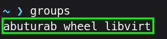

The virt-manager on all almost every Linux distro, asks for password when it's opened from the apps' menu. It's happens because `libvirt` runs as a root, and we need to be either root or get elevated privileges to access virtual machine managed via libvirt/KVM.

## Adding `$USER` to `libvirt` Group

To fix this, make a `libvirt` group and add yourself to it.

```console
sudo usermod -aG libvirt $USER
```

- `sudo` Runs the command as root
- `usermod` System Utility to modify system account files
- `-a`/`--append` Append user to supplementary group(s), used only with `-G`
- `-G`/`--groups` When used with `-a`, it appends user to the supplementary group
- `libvirt` The name of the group being added
- `$USER` An environment variable expands to a logged-in username

Logout and log back in:

Run the following command in the terminal:

```console
groups
```

You can see the newly created `libvirt` group:



## Removing $USER from `libvirt` Group

To remove yourself from the `libvirt` group:

```console
sudo gpasswd -d $USER libvirt
```

- `gpasswd` System utility to manage groups and their passwords
- `-d`/`--delete` Remove the user from the named group

> [!INFO]
> These commands are available on almost every Linux distro, but I have tested them only on Fedora Workstation.