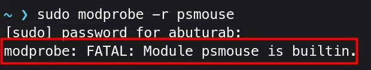
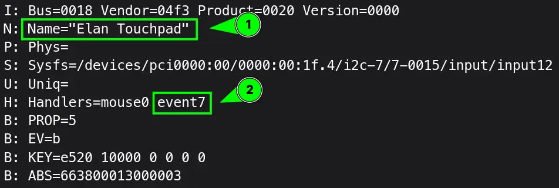

There is a bug affecting Fedora and Archlinux systems, where system cursor gets frozen in a place when your PC wakes up from the sleep.

> [!INFO] ''
> I have tested this fix on my ThinkPad only, both on Archlinux and Fedora.

## Archlinux

To regain the control of your cursor, it's quite easy, you need to reload the `psmouse` module.

From the Terminal, run this:
```console{linenos=false}
sudo modprobe -r psmouse
```
It will remove the `psmouse` Kernel module.

Then, to reload the module:
```console{linenos=false}
sudo modprobe psmouse
```

Voilà, your cursor is back.
- `modprobe` Add or remove Kernel modules
- `-r`/`--remove` Removes the specified Kernel module
- `psmouse` General Kernel module for Touchpads and Mouse.

## Fedora

When you run the command:
```console{linenos=false}
sudo modprobe -r psmouse
```

It spits the following error:


To regain control of a cursor on Fedora, you need the exact driver name of your Mouse/Touchpad.

First, to find out the name of your Touchpad/Mouse name:
```console{linenos=false}
cat /proc/bus/input/devices
```

Look for your Mouse/Touchpad name


Note the `event_id`, then run following command replacing `<event_id>` with your handlers ID.
```console{linenos=false}
readlink /sys/class/input/<event_id>/device/device/driver
```

Note the driver name, in my case it was `elan_i2c`:


Now, to remove the Kernel module of touchpad/mouse:
```bash{linenos=false}
sudo modprobe -r elan_i2c #replace with your own driver module name
```

Then, reload the driver:
```bash{linenos=false}
sudo modprobe elan_i2c #replace with your own driver module name
```

Voilà, your cursor is unfrozen on Fedora too.