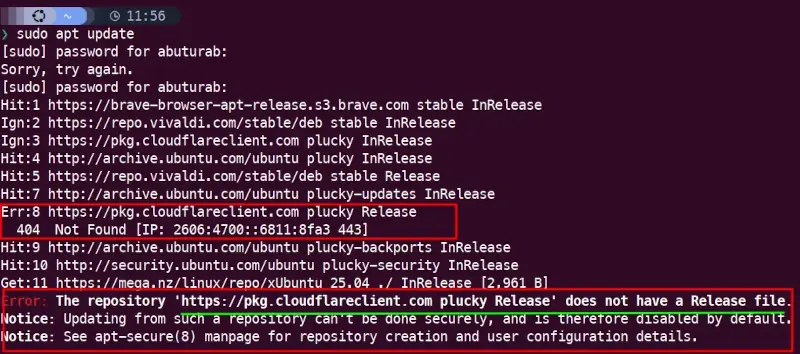
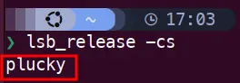

## Overview of WARP Client Packaging on Linux

The official supported releases for Cloudflare Warp client for Ubuntu/Debian based systems are:

### Ubuntu: The Supported Releases

The supported releases are:

- Noble (24.04)
- Jammy (22.04)
- Focal (20.04)

### Debian: The Supported Releases

The supported releases are:

- Bookworm (12)
- Bullseye (11)
- Buster (10)

Builds for older Ubuntu and Debian releases are also available.

## The Problem: Unsupported Release Errors

If you are on newer releases like Ubuntu 25.04 (Plucky Puffin) or soon to be released Debian 13 (Trixie), you're out of luck for the installation of Cloudflare Warp Client on your system.

You follow the [official instructions](https://pkg.cloudflareclient.com) to add the respective Debian/Ubuntu repo to your system. But when you run the system update command to populate that repo package:
```terminal
sudo apt update
```

You are met with the following error:



## The Solution: Manual Repository Fix

Let's look at the repo `cloudflare-client.sources` file in the `/etc/apt/source.list.d/` directory:

```yaml
Types: deb
URIs: https://pkg.cloudflareclient.com/
Suites: plucky
Components: main
Signed-By: /usr/share/keyrings/cloudflare-warp-archive-keyring.gpg
```

Let's check the release codename for our Debian/Ubuntu based system:

```terminal
lsb_release -cs
```



As we can see from the [Ubuntu Supported Releases](#ubuntu) above, **Plucky Puffin** or **Ubuntu 25.04** isn't currently a supported version.

To make it work, let's change the `Suites: plucky` section of the `cloudflare-client.sources` file to the last supported Ubuntu's release codename:
```yaml {hl_lines=3}
Types: deb
URIs: https://pkg.cloudflareclient.com/
Suites: noble
Components: main
Signed-By: /usr/share/keyrings/cloudflare-warp-archive-keyring.gpg
```

> [!TIP]
> To fix the `cloudflare-client.list` repo file, replace this `deb [signed-by=/usr/share/keyrings/cloudflare-warp-archive-keyring.gpg] https://pkg.cloudflareclient.com/ noble main` with the old value.

After this, run the system update command:

```terminal
sudo apt update
```

Now normally install the Cloudflare Warp client on your Debian/Ubuntu based system.

```terminal
sudo apt install cloudflare-warp
```

> [!TIP]
> The Process to fix the **Missing Release file** error is the same for other Debian and Ubuntu based systems. You will need to replace the current release codename with their last supported one, in the repository source file.

---
## References

- [Cloudflare Warp Linux Client](https://pkg.cloudflareclient.com) --- Officially Supported Linux Distros and their Release Names
- [Using Warp on Linux](https://developers.cloudflare.com/warp-client/get-started/linux/) --- How to set up Cloudflare warp client on Linux
- <a href="https://www.freepik.com/free-vector/cloud-computing-remote-encryption-background-safeguarding-data-web_385420046.htm#fromView=search&page=1&position=6&uuid=f19b92ee-c86e-4718-a3ec-33e9276215eb&query=cloudflare+warp">Image by starline on Freepik</a> --- Credits for a Cover Image
