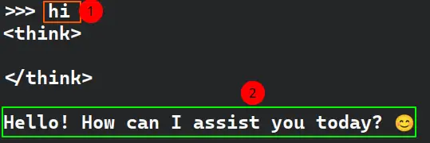

DeepSeek is a Chinese AI company that has recently rattled the cages in the international LLM business due to its state-of-the-art performance with minimal running costs. Its latest `R1` model performs on par with, or even better than, OpenAI's `o1` model in some scenarios.

## Why Run DeepSeek Locally?

Both [OpenAI](https://openai.com/policies/row-privacy-policy/) and [DeepSeek](https://chat.deepseek.com/downloads/DeepSeek%20Privacy%20Policy.html) clearly mention in their respective privacy policies that they collect, store and analyze all your data collected via model interactions (voice/text etc.), support requests, and their Partners (but not limited to).

You waive all rights to your private information, allowing these companies to use it as they see fit.

The only way to regain control is to use and run these models on your own hardware. You can even choose to completely disconnect the machine from the internet to ensure there is no phone home.

> [!TIP]
> Isolating your machine from the network is completely optional. The software programs we use for running local LLMs are already open-source and ensure that no network connections occur without your explicit permission.

Until now, we had open-source models like `LLAMA3.3`, `Mixtral`etc. which could be run locally, but their performance was not impressive enough to match that of OpenAI, Claude, etc.

However, with DeepSeek's entry into the market, open-source models are now more capable than ever of performing complex tasks.


> [!TIP]
> These instructions might apply to macOS and Windows (especially when using WSL). Please see the reference section for instructions specific to your platform.

Now, we will go through steps of using `DeepSeek` locally on our Linux System.

## System Requirements

- Preferably Quad Core AMD/Intel CPU — You can run 1/1.5b parameters models quite easily on fairly old CPUs with only iGPU.
- AMD/NVIDIA dGPU — Optional to run medium to large size models.
- 8/16 GB ram DDR3 RAM — more recent ram with high capacity is always recommended.


| Must Have               | Good to Have         | Optional     |
| ----------------------- | -------------------- | ------------ |
| Raspberry Pi            |                      |              |
| Intel/AMD Quad core CPU | Recent AMD/Intel CPU |              |
| iGPU*                   | dGPU — AMD/NVIDIA    |              |
| 64 GB storage**         | SSD/NVME             | >128 GB NVME |
| 8 GB RAM                | 16 GB RAM            | >32 GB RAM   |

\* For smaller models only CPU is used.

\** Smaller models use a lot less storage.

## Installing OLLAMA

OLLAMA is an open-source tool used to run large language models (LLMs) locally on your computer.

It allows you to install and run a vast number of open-source models directly on your machine.

Run the following command in your terminal to install OLLAMA:

```sh
curl -fsSL https://ollama.com/install.sh | sh
```

If you don't have a dedicated GPU, you may get this warning in the console:


We can safely ignore this message, as we already know without dGPU, we can only run smaller models.

Then go to [OLLAMA Website](https://ollama.com/search) and search `deepseek-r1` and open the first search result:

You will see something like this where:
1. Model Name
2. Available Parameters
3. Currently Selected Model (Parameters)
4. Command to install the selected model
5. Last update of selected model + size of the selected model
6. More technical info


I will install the `deepseek-r1:1.5b` model:

```console
ollama run deepseek-r1:1.5b
```


After installation is complete, you will be directly dropped in the model's chat console, where you can start asking questions right away.



To quit the model:

```console
/bye
```

Now from the main terminal, you can list the installed models (`ollama -h` will show all the available commands):

```console
ollama list
```

To run the model again:

```console
ollama run <model-name>
```

It will only accept the full name of the model like this `ollama run deepseek-r1:1.5b`.

Now you have access to your own local LLMs, where you own your data and nobody else is snooping on you. You can stop here in the tutorial and start experimenting with other local LLMs in your terminal. Alternatively, keep reading to learn about installing a GUI for your local LLMs.

## Open-WebUI: GUI for Local LLMs

> [!INFO] It's a fairly big install, avoid installation on metered connections.

Though running LLMs inside a console feels like hacking the mainframe 😇. But for the sake of convenience, we can use Graphical User interface (GUI) too.

Open-WebUI is an open-source user-friendly GUI to interact with your local LLMs (though not limited to local LLMs only).

There are two ways to install it:

1. Via PIP (which is a commandline package manager for Python)
2. Via Docker (a lightweight container environment)

In this tutorial we will use PIP, which is in most cases already available on `UNIX` systems.

>[!TIP] Check [reference](#references) section for docker install.

Run the following command:

```sh
pip install open-webui
```

I advise on installing this software inside a Conda environment, which will be separate from your local instance of Python. This way you can keep your home environment clean.

### Installing `miniconda`

Run these commands in your terminal:

```sh
mkdir -p ~/.miniconda3
wget https://repo.anaconda.com/miniconda/Miniconda3-latest-Linux-x86_64.sh -O ~/.miniconda3/miniconda.sh
bash ~/.miniconda3/miniconda.sh -b -u -p ~/.miniconda3
rm ~/.miniconda3/miniconda.sh
```

After installation is complete close and re-open your terminal or run the following command to immediately start using `conda` command in your terminal:

```sh
source ~/.miniconda3/bin/activate
```

To initialize `conda` on all available shells, run this command:

```sh
conda init --all
```

This will add the Conda initialization config to the available shells (zsh/bash).

Run to turn off auto activation of `base` Conda environment in your shell (OPTIONAL):

```sh
conda config --set auto_activate_base false
```

### `miniconda` Installing Open-WebUI

First create your `conda` environment:

```conda
conda create -n <your-environment-name> python=3.11
```

Open-WebUI requires Python >= 3.11. So we will create our environment with python 3.11.

Now run this command:

```sh
pip install open-webui
```

It will take few mins depending on your network speed, to install the necessary dependencies and main package.


### Usage

After installation is complete, execute the following command;

```sh
open-webui serve
```

After fetching necessary package, it will provide you a `localhost` address, to access your `open-webui` panel from the browser.


It will ask to create an account, which will act as an admin.

> [!INFO] 
> This is a local only account, or if you want to use your local LLMs via internet, when not on your home computer. You will need these credentials to access your LLMs on your computer (You will need to set up port-forwarding/Cloudflare tunnels).


After creating an account, you will be greeted with a screen where you can ask questions, take coding help, or analyze documents, depending on your model.


That's all for now. Feel free to explore different LLMs and enjoy the benefits of your private AI assistants. If you have any questions or feedback, please leave a comment below!

---

## References

- [OLLAMA Download](https://ollama.com/download) --- Follow the download instruction according to your OS.
- [OLLAMA Available Models](https://ollama.com/search) --- Choose which model you like to install on your ollama instance.
- [How to install Open WebUI](https://github.com/open-webui/open-webui?tab=readme-ov-file#how-to-install-) --- Official Installation instructions via PiP and Docker.
- [Miniconda](https://docs.anaconda.com/miniconda/install/#quick-command-line-install) --- MiniConda installation docs.
- [you NEED to run DeepSeek locally - Linux Guide](https://www.youtube.com/watch?v=ptRkk_jzvZw) --- TechHut video about OLLAMA and Open-WebUI installation (He uses docker installation method for Open-WebUI).
