If you go to [Gmail Website](https://mail.google.com), and look for the connection information, it will say **connection is secure**. <mark style="background: #FF5582A6;">Does that secure mean private too?</mark> Not at all.

**Connection is secure** only means, between you and Google servers, there is no one snooping on, on your emails. But Google can/will read your messages, either on Governments' requests or for advertising purposes. The same is the case with **Microsoft Outlook**.

> [!NOTIFY]
> According to the [sources](https://blog.google/products/gmail/g-suite-gains-traction-in-the-enterprise-g-suites-gmail-and-consumer-gmail-to-more-closely-align/), Google stopped scanning email content for Ads personalization back in 2017 for non-enterprise users too. But they will still use your email meta-data and other services (Google and 3<sup>rd</sup> party) activities for the ads shown in the Gmail.

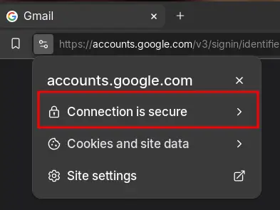

## Email Protocol and the Missing Layer of Privacy

By design, e-mail used for non-encrypted communications. There is no built-in End-to-End Encryption (E2EE) support available for email protocol. Unlike encrypted chat apps like **Signal**, **Briar** etc., are by-design built for security and privacy in mind, so they offer E2EE support from ground up.

After the rise of `HTTPS`, the transfer of E-mails between the two parties became secure enough, but that security goes to the drain, when your E-mail provider can/will read your emails without any hassle or your knowledge about it.

If Google servers ever get compromised, then you're not only exposed to them (Google, Governments etc.), but now the hackers too, as Google holds the encryption keys for your E-mails.

> [!tip]
> **E2EE** ensures, no one, except the communicating parties, would be able to read/listen to the conversations happening on the wire.

## PGP: Filling the Security Gap in the Email Protocol

PGP (Pretty Good Privacy) is a widely-used encryption standard that enables secure, end-to-end encrypted communication by encrypting emails with a unique key pair. It ensures that only the intended recipient can read the message, closing the security gaps in traditional email protocols.

So, when you encrypt your Gmail/Outlook emails with your **PGP Key pair**, you're the owner of the encryption keys, and your email provider will have no information about the content of the emails.

We will cover how to do this pretty easily on Mobile (Android) and Desktop (Linux/macOS/Windows).

## Android: A guide to Email Privacy

On Android, you need any of the following email clients:
- [Thunderbird Email](https://f-droid.org/en/packages/net.thunderbird.android/)
- [K9-Mail](https://f-droid.org/en/packages/com.fsck.k9/)

To enable end-to-end encryption using PGP, you will need **[OpenKeychain: Easy PGP](https://f-droid.org/en/packages/org.sufficientlysecure.keychain/)** app, which will handle your personal PGP keys creation and other users' public keys.

I will recommend the **[Thunderbird](https://www.thunderbird.net/en-US/thunderbird/all/)** client as it's more modern and better maintained. As well as, you can use the same on the Linux/macOS/Windows too.

### **OpenKeychain: Easy PGP**

First install the OpenKeychain app:
- When you first open the app it will look like this:

  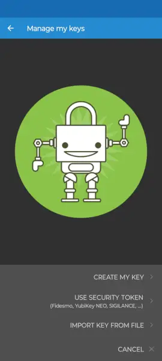
  
- Click on the **CREATE MY KEY**
- Enter your desired name

  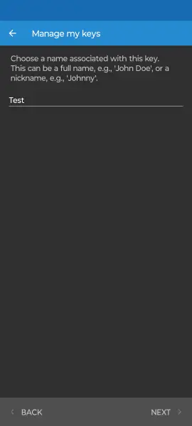
  
- Click `next` and fill your `email`

  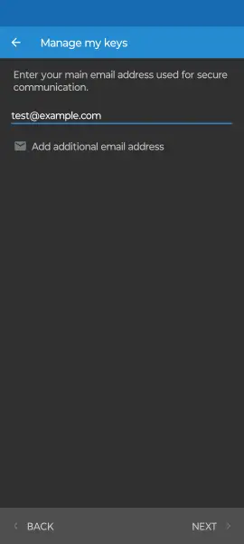
  
- Click `next`, and your filled info will be there.
- The option `Publish on Keyservers` will upload your public key to known servers, so others can easily find your public key.
- Some email clients by-default check those servers for the public keys of the emails when encryption is used.

  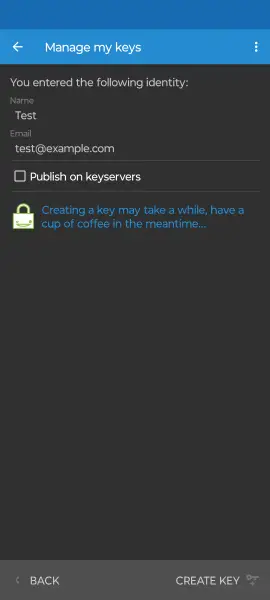
  
- By clicking on the three-dot menu in the top-right corner, you can customize the `key algorithm` used. I will recommend to stick with defaults for now.
- Click on the `CREATE KEY`. Your PGP key pair is ready to be used.

  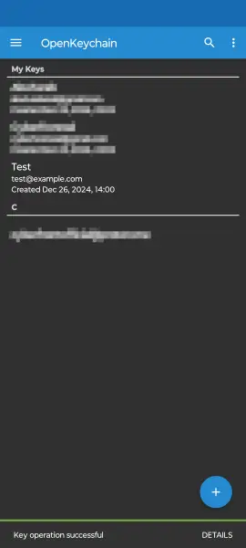

When you want to send message to some email address like [My Email](mailto:cyberfrontofficial@proton.me), you can add their public key ([My PGP Public Key](/misc/publickey.asc)) by click on the `+` and then select `Import from File`.

### **Thunderbird**

Install the Thunderbird app.
- Sign-in to your Google/Outlook account.
- Go to settings
- Click on the account, you want to enable the encryption for

  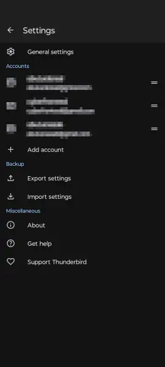
  
- Click on the `End-to-end encryption` button

  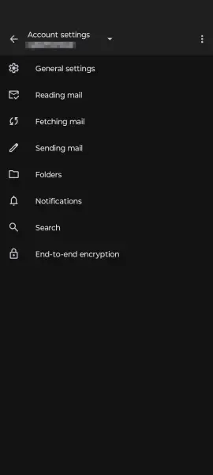
  
- Click on `Enable OpenPGP support`
- You can select the key for your account by clicking on `Configure end-to-end key`. It will show all the keys saved in the `OpenKeychain` app.

  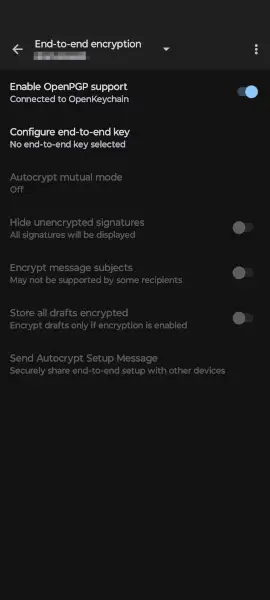

> [!INFO]
> By default, your Subject of the emails is not encrypted. You can toggle that setting `Encrypt message subjects` on, but do remember some Email providers might not support it, your subject will appear gibberish to them, despite decrypting the rest of the email.

Now share your public key to world by clicking on the key stored in your `OpenKeychain` app. You can simply copy the app by clicking the `copy icon` or share it via `share icon`.

  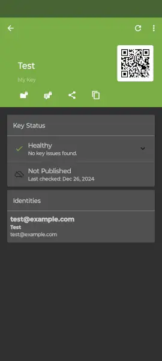
  
> [!TIP]
> You can/should back up your `PGP Key Pair`, by clicking on the `three-dot menu`, a back-up key will appear, which you have to remember to import back your key pair.
> This will back up your both private and public keys, which you can then import on Linux/macOS clients. Keep your back-up safe and secure. You won't be to decrypt your messages if you lost your key-pair.

Let's test the encryption.

You need to import the `Public PGP Key` of the receiver, and then go-to `Thunderbird` app, click the `pencil icon` to write a new email.

A padlock will appear, you can enable or disable the encryption by clicking the padlock (A green padlock icon means, encryption is enabled).

  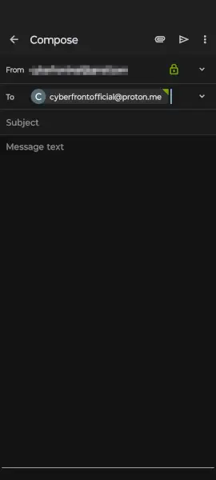

This is how Gmail/Outlook web versions will look like for E2EE email. The body of the email isn't visible at all on the PC version of Gmail.

  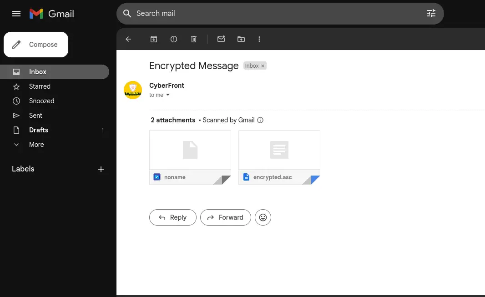

While on the mobile version, it looks like this:

<style>
  .video-container {
    display: flex;
    justify-content: center;
    align-items: center;
    height: auto; /* Adjust this if you want it to be centered within a specific height */
  }
</style>

<div class="video-container">
  <video controls style="height: 400px !important;" type="video/mp4">
    <source src="email-encryption.mp4">
    Your browser does not support the video tag.
  </video>
</div>

While on the `Thunderbird` app encrypted message will look like this (after decryption of-course):

  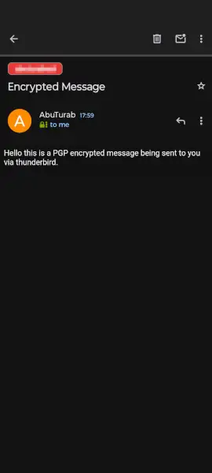


## Linux: How to use PGP Keys with Thunderbird

Firstly, install and login to your account on Thunderbird.

On Linux, decrypt your OpenKeychain back-up, it will ask for passphrase which was provided while taking a back-up inside `OpenKeychain` app.

```bash
gpg --decrypt backup_2024-12-26.sec.pgp #Replace it with your backup file name
```

It will print the both of your public and private keys in the terminal. Copy those keys and save them separately inside `public.asc` and `private.asc` files.

The file content will look like this:

```console
-----BEGIN PGP PUBLIC KEY BLOCK-----

xjMEZIm3FBYJKwYBBAHaRw8BAQdA2nvBs8t/Yo0Raanwz+kogC+dA6ZbCPP2
G2RTXkDdUhvNO2N5YmVyZnJvbnRvZmZpY2lhbEBwcm90b24ubWUgPGN5YmVy
ZnJvbnRvZmZpY2lhbEBwcm90b24ubWU+wowEEBYKAD4FgmSJtxQECwkHCAmQ
QeurkAdX1zADFQgKBBYAAgECGQECmwMCHgEWIQSyoXSPM7roXlqcScdB66uQ
B1fXMAAAz/UA/j1OJAJ8wt1pa91yydTPpbeqd2Phb53ZHY/OtMvB0mA7AQDj
uh6LKHtLikrlhycMzlz2/FFJL4Zhi+er2BajZZ7OCc44BGSJtxQSCisGAQQB
l1UBBQEBB0AdQsDzQ/6vSBuFg16rZCY9cMf37jMMyVKC9nfSiIW/MgMBCAfC
eAQYFggAKgWCZIm3FAmQQeurkAdX1zACmwwWIQSyoXSPM7roXlqcScdB66uQ
B1fXMAAAR3sA/jHy12ZX5JQiE/n46LYwre2Zgcu9wejYvg/KNfV4bbfcAP9i
sBbArKtWvvDMh1Lw2pW8hhF9/bn+xI363bW2HdqUBw==
=wB2O
-----END PGP PUBLIC KEY BLOCK-----
```

Go-to Thunderbird settings and then account settings, click on `End-to-End Encryption` button

  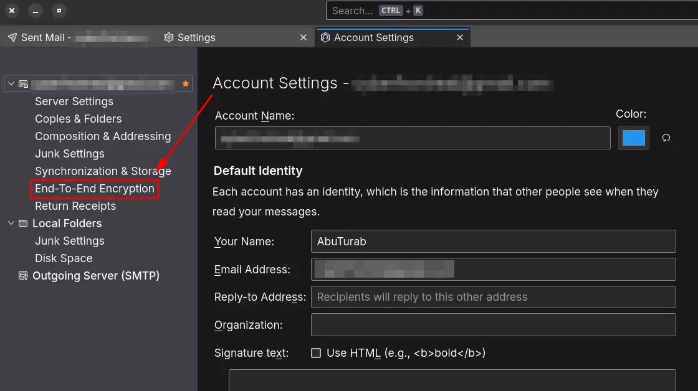

Now click on the `OpenPGP Key Manager`:

  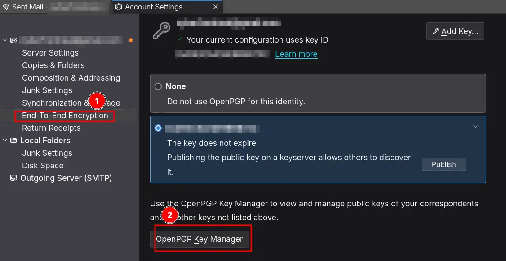

With `OpenPGP Key Manager`, you can import your both public and private/secret keys separately by click on `file` button up-top.

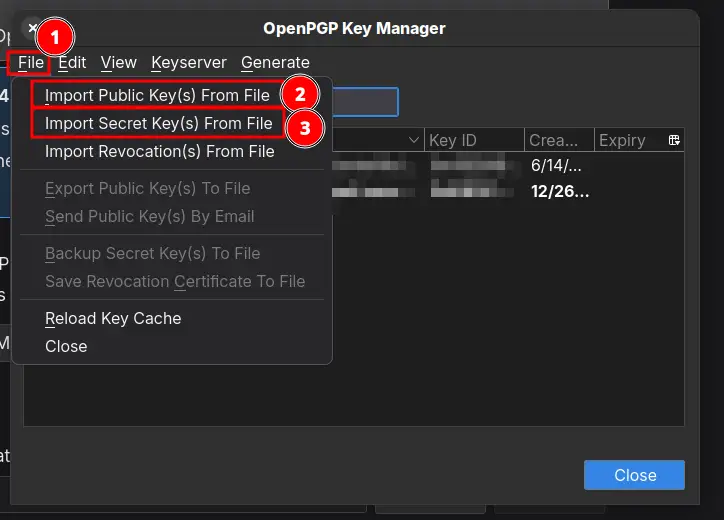

After importing both keys, you are set for E2EE use. (You will again need to add the PGP Public Key of the receiver to encrypt the message)

Click new message: If you enter an email address for which you have added the PGP Public Key of theirs, it will show you a prompt to enable E2EE.

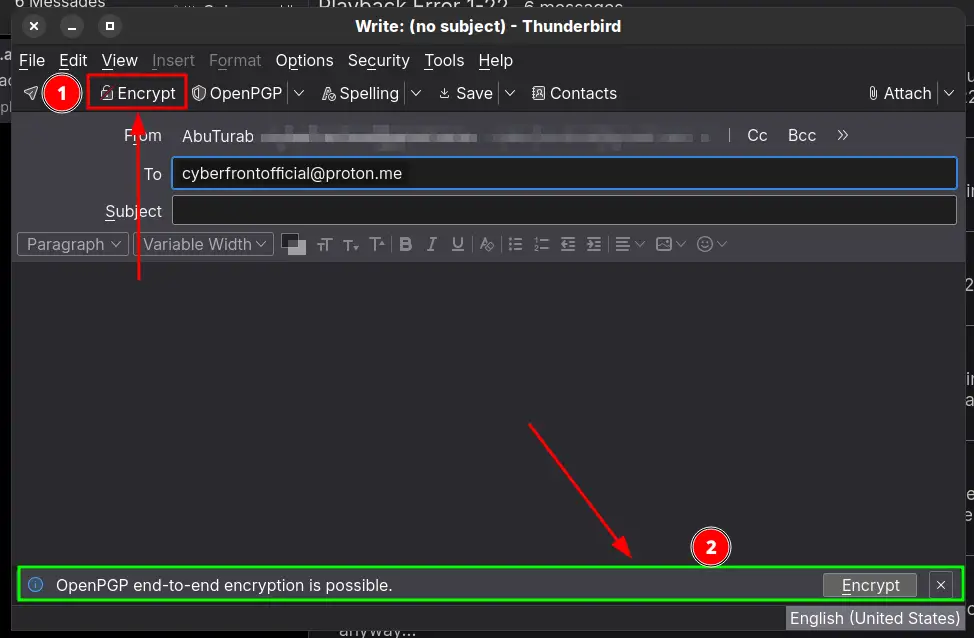

> [!TIP]
> As we are using Thunderbird's own PGP Key Manager, the method of enabling E2EE on Windows and macOS will be the same when using [Thunderbird Client](https://www.thunderbird.net/en-US/thunderbird/all/).

## What's Next?

Digital privacy and security are ongoing battles. Staying informed about emerging threats and evolving security solutions is crucial. Below, you’ll find links to articles about more private alternatives for email and other everyday tech. Explore, implement, and take charge of your digital safety. Stay safe and secure!

---

## References

1. [How private is your Gmail, and should you switch?](https://www.theguardian.com/technology/2021/may/09/how-private-is-your-gmail-and-should-you-switch) --- The Guardian Piece about Gmail privacy practices.
2. [OpenKeychain Alternatives](https://alternativeto.net/software/openkeychain/) --- You can check PGP manager apps for iOS.
3. [Thunderbird Download](https://www.thunderbird.net/en-US/thunderbird/all/) --- You can get Thunderbird for Linux, macOS, and Windows.
4. [Privacy Guides](https://www.privacyguides.org/en/tools/) --- More private alternatives for everyday Tech Tools.
