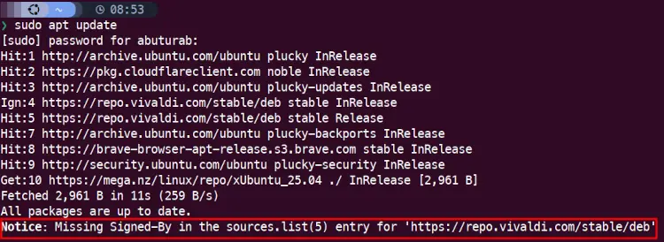

When you download the `.deb` package from [Vivaldi's website](https://vivaldi.com/download/), and manually install it. The installation process will also add the Vivaldi repo to the apt-sources list in the `/etc/apt/sources.list.d/` directory.

Sometimes this repo doesn't normally populate the GPG keying for the Vivaldi Browser repository, and you will get errors like below, whenever you do a system update like this:
```terminal
sudo apt update
```



## Fixing the GPG Singing Error

You can either ignore the error completely, and you don't immediately lose anything. But when `APT` source is not cryptographically verified, it opens up the possibility of man-in-the-middle attacks or tampered packages. So, you should always add GPG singing keys for your repos.

### Fixing `vivaldi.list` repo

This `[repo-name].list` is the old method for storing repo files.

First we will add the GPG Keyring for Vivaldi repo, in the `/usr/share/keyrings/` directory.
```terminal
wget -qO- https://repo.vivaldi.com/archive/linux_signing_key.pub | gpg --dearmor | sudo dd of=/usr/share/keyrings/vivaldi-browser.gpg
```

Before adding the key, your `vivaldi.list` repo looks like this:
```term
### THIS FILE IS AUTOMATICALLY CONFIGURED ###
# You may comment out this entry, but any other modifications may be lost.
deb [arch=amd64] https://repo.vivaldi.com/stable/deb/ stable main
```

To fix the error, modify the `vivaldi.list` file like this:
```term
deb [arch=amd64 signed-by=/usr/share/keyrings/vivaldi-browser.gpg] https://repo.vivaldi.com/stable/deb/ stable main
```

After that, just run the regular system update command:
```term
sudo apt update
```

The **Missing Signed-By** errors should disappear now.

### Fixing `vivaldi.sources` repo

Ubuntu is in the process of transitioning from `.list` files to `.sources` files for APT repositories. The `.sources` file support YAML-like format, which is easy to read and manage.

After adding the GPG keyring (as described earlier), we can now fix the `vivaldi.sources` file.

Before doing anything, `vivaldi.sources` file looks like this:
```terminal
Types: deb
URIs: https://repo.vivaldi.com/stable/deb/
Suites: stable
Components: main
```

To fix the **Missing Signed-By** error, modify it like this:
```terminal
Types: deb
URIs: https://repo.vivaldi.com/stable/deb/
Suites: stable
Components: main
Signed-By: /usr/share/keyrings/vivaldi-browser.gpg
```

Then, update your system like before:
```terminal
sudo apt update
```

The singing error should be fixed now.

---
## References

- Cover <a href="https://www.freepik.com/free-vector/computer-repair-illustration_17714407.htm#fromView=search&page=1&position=3&uuid=8c5adb0f-fa3d-4d58-9de8-744e5bb3d3d5&query=gpg+errors">Image by macrovector on Freepik</a>
- [Pub key missing](https://forum.vivaldi.net/topic/82801/pub-key-missing) --- Vivaldi Forum discussion about the Issue