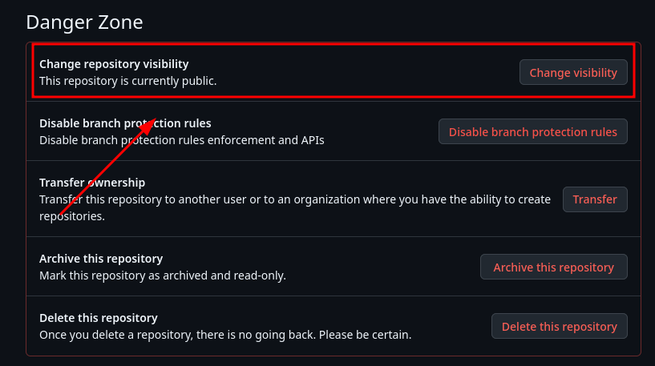
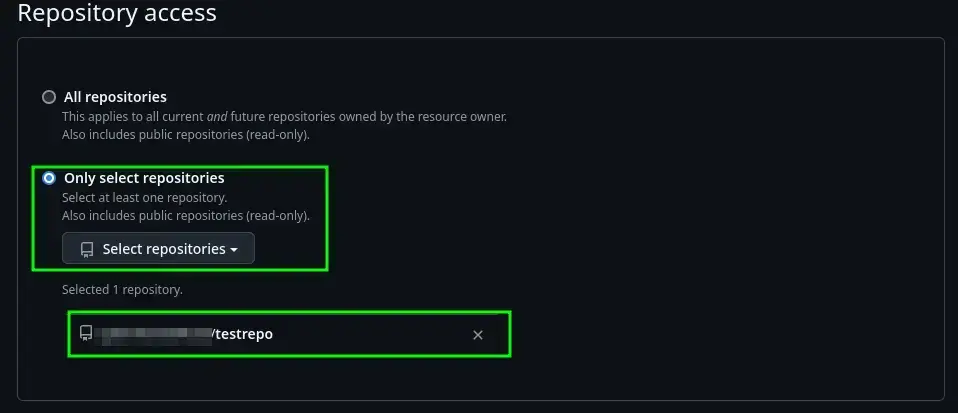
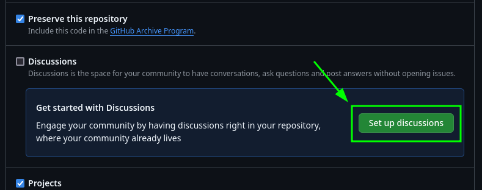

**Giscus** is an open-source commenting system, which uses **GitHub discussions** as a backend. Unlike **Disqus**, which is a popular-closed source system for comment section on websites, you don't need any database setup. As **Giscus** will use **GitHub Discussions** as a backend. 

Giscus allows you to:
- React on the posts
- Add comments using respective GitHub account.
- Support Custom theming
- Can be self-hosted

## Prerequisites

Hugo comes with **Discus** template by default, but to add other commenting systems, you need to perform few extra steps.

Before Giscus setup, you need to make sure:

> [!IMPORTANT]
> 1. Your GitHub repository is **Public**
> 2. You have installed the **Giscus app** on your GH account
> 3. The repo **Discussions feature** is turned on

### How to Make a GitHub Repository Public

Go-to this link

```url
htpps://github.com/<username>/<your-repo-name>/settings/#danger-zone
```

Replace `<username>` with GH username and `<your-repo-name>` with your respective repo.

Click on the `Change repository visibility` and make it `public` after accepting all the terms.



### Installing the Giscus App on Your GitHub Account

To add **Giscus app** to your GH account follow [this link](https://github.com/apps/giscus). And click `Install`. 

Then a popup will appear like below, and you can select any of the two options, but I will advise for security reasons to choose `Only select repositories`.


And select your desired GH repo, where you have stored your Hugo website files. And you're done.



> [!TIP]
> Don't stress too much about what permissions to give to Giscus right away. You can change that setting later from **[here](https://github.com/settings/installations)**, and click `Configure`.
>
> 

### Enabling the GH Discussions Feature in Your Repository

Go-to this link by replacing `<username>`, `<your-repo-name>` with your actual credentials:

```link
https://github.com/<username>/<your-repo-name>/settings/#features
```

And click `Set up Discussions` and they will be enabled. GitHub will show a sample announcement Discussion, you can safely ignore it, or customize it to your liking.



---

Now you have completed the prerequisites for **Giscus app** setup on your website, so, you can go to **[this link](https://giscus.app/)**, and start filling in the necessary information.

## Configuration at Giscus.app

All the [configuration options](https://giscus.app/) depend on what you want to use. So pick what you like and there will be a `script` generated at the bottom of your configuration on the same page.

<div class="video-container">
  <video controls>
    <source src="giscus-and-hugo-4.mp4" type="video/mp4">
    Your browser does not support the video tag.
  </video>
</div>


My configuration `script` looks like this:

```html
<script src="https://giscus.app/client.js"
        data-repo="cyberfrontofficial/testrepo"
        data-repo-id="R_kgDONftE5w"
        data-category="General"
        data-category-id="DIC_kwDONftE584ClXEf"
        data-mapping="title"
        data-strict="0"
        data-reactions-enabled="1"
        data-emit-metadata="0"
        data-input-position="bottom"
        data-theme="dark"
        data-lang="en"
        crossorigin="anonymous"
        async>
</script>
```

## Set-up Hugo PaperMode Theme

Create a `comments.html` file inside your Hugo directory at `<Your-Hugo-Site>/layouts/partials/` folder.

Add your copied `script` from `giscuss.app` page to `comments.html` file and save it. 

## Enabling Giscus

You can simply add this to your posts' **frontmatter**. In this way can enable/disable the comment section based on individual posts.

```yaml
---
comments: true
---
```

Or add following to your config/hugo.yaml file:

```yml
params:
  comments: true
```

This will enable comments on site wide basis including `about.md`, `privacy.md` etc. To disable commenting on those pages, you can just add `comments: false` to your page **frontmatter**.

> [!CONCLUSION]
> Now comments section is enabled on your website. If you have any questions/suggestions, you can comment down below!

---

## References

1. [Giscus](https://giscus.app) — A commenting system powered by GitHub Discussions.
2. [Hugo Comments Docs](https://gohugo.io/content-management/comments/) — Official Hugo documentation for enabling comments.
3. [PaperMod Docs](https://github.com/adityatelange/hugo-PaperMod/wiki/Features#comments) — Guide to enable comments in the Hugo PaperMod theme.
