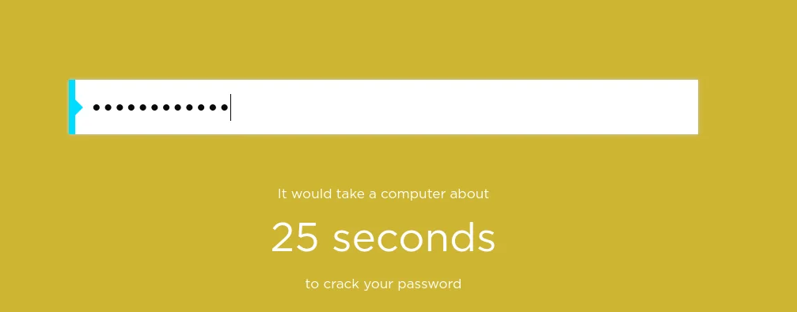
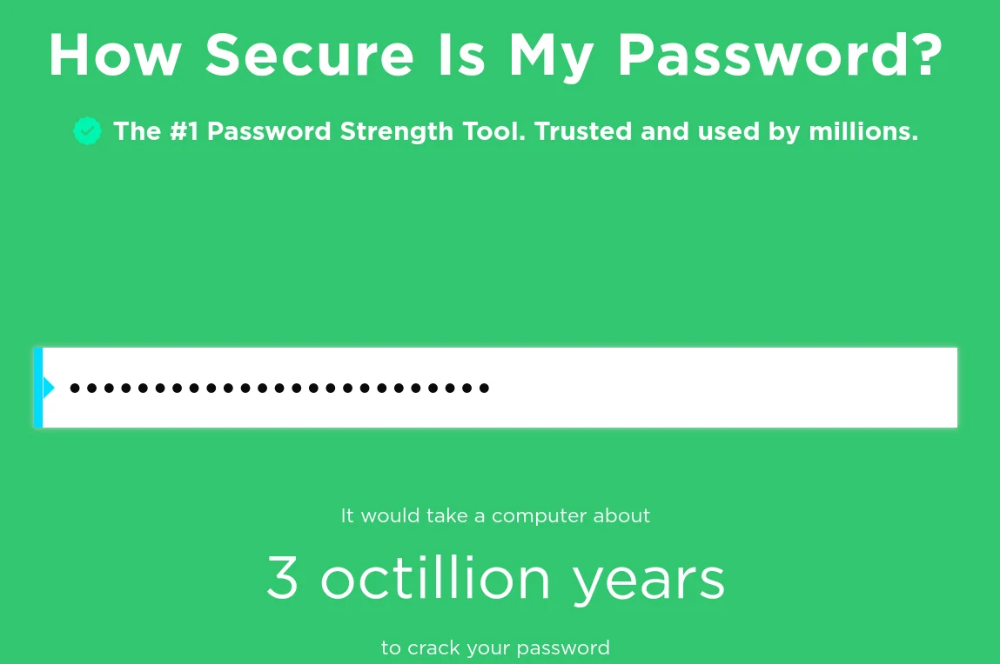
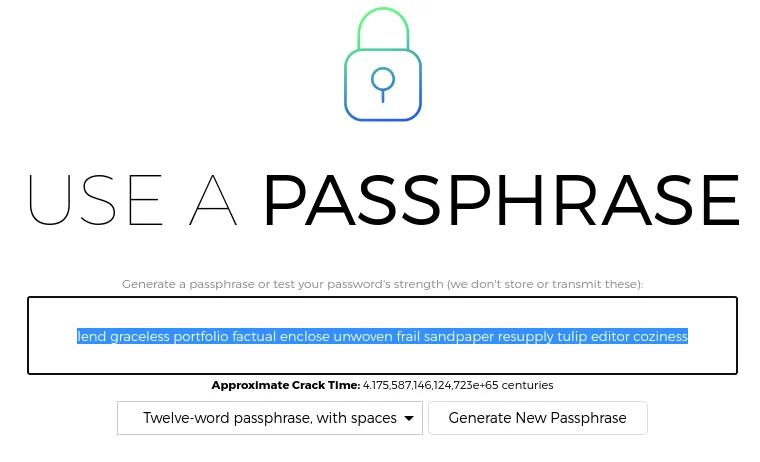
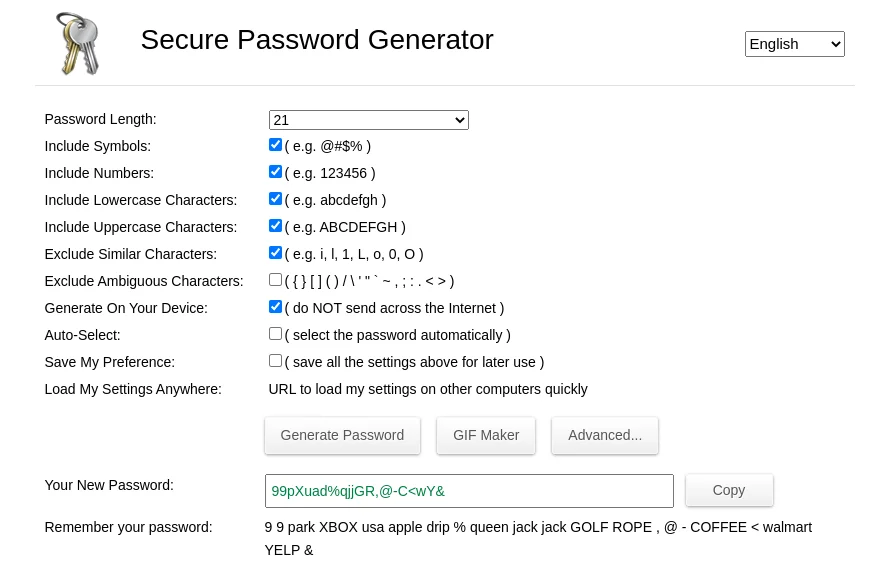

## **Importance of Good Password Hygiene**

We live in the internet era, where we share everything about our lives on social media, we have bank accounts and digital wallets. We do online shopping, send and receive emails, do chat and run business using the internet. In short, our whole life lives on the cloud, if we won’t be careful enough, this information can get leaked or hacked by the cyber criminals. They can use this information to steal our money, to do identity fraud, or leak the sensitive information about our private lives and businesses which can affect us emotionally and financially.

## **Don’t Use Weak Passwords**

Like we show diligence to protect our physical belongings, protecting our online identity becomes more important in this day and age, as we’re moving towards the hybrid world where we do most of the things online. Saving our online identity is as much crucial as saving ourselves from a wild animal. So the first step in the right direction is, use a strong password, no matter how annoying it is. Due to laziness and lack of awareness, we tend to use weak passwords and, worst of the all, use the same password for everything. This negligence can lead to some unfortunate results.

### Examples of weak passwords

Before moving towards the topic of making our passwords strong, first let’s discuss some examples of weak passwords:

- Using your birthday, anniversary, friend’s or pet’s name, as your password
- Using only numbers, like your phone number, your birthday date, month, and year etc.
- Using Generic Passwords like password, password123, qwerty, abc123, princess, sunshine etc.

A 12 character password consisting only of digits can be hacked in less than 25 seconds.

## **How to check your Password Strength?**

To know, how much time a computer will take to crack your password, visit:

<https://www.security.org/how-secure-is-my-password/>

### List of most common passwords:

<https://nordpass.com/most-common-passwords-list/>

### What it takes to make a strong password?

There are some standard rules which make sure that our password is strong enough to provide considerable amount of strength against the brute force attacks.

- At least 12 characters
- Mixture of both upper and lowercase letters
- Mixture of letters and numbers
- Inclusion of at least one special character, e.g., ! @ # ?]
- Use two factor or multifactor authentication

> [!TIP]
> Tip: Don’t use <, > as they can cause problems in the web browsers.

## **Passphrase**

A passphrase is a sentence like string used for authentication and that is longer than a traditional password. Using a memorable long passphrase is better than using a short password.

### Passphrase Best Practice

Following are some standard practices to keep in mind while using passphrases:

- Use easy to remember but uncommon group of four to eight words
- Use spellings that only make sense to you
- Use spaces and punctuation between the words
- Use capital or capitalize certain letters of your passphrase

### Advantages over traditional passwords

- A Passphrase is easy to remember
- More secure than passwords as it include more characters and punctuation

Let’s assume a funny situation. **A monkey is using a computer in a car while driving.**

A passphrase would be like: **Monkey-Laptop-Car-Driving**

It would take a computer approximately 3 octillion years to crack this memorable passphrase.

## **Tips for Keeping your Passwords & Passphrases Safe**

For keeping your accounts free from hackers and information leakage, apply the techniques like.

- Change your password and passphrases every 3–6 months
- Change them, if you have even the smallest suspicion of them becoming known by a human or a machine
- Avoiding typing on computers or phone you don’t trust, like in an internet café or library
- Never auto save them in the browsers on the computer you don’t have control of or is shared by other persons as well
- Never tell your password/passphrase to anyone
- Never write them down
    
> [!INFO]
> How to safely store your passwords and passphrases is another topic which will be discussed in the coming blog/video.

### Use a Password and Passphrase Generators

Relying on human skills to generate good passwords or passphrases with above-mentioned qualities is not recommended, as we tend to undermine the risks and show laziness for protecting our online identities. Thus, you should use password and passphrase generators which make sure with the available switches that they have all the features of a good hygiene.

To generate passphrases & passwords online:

1) <https://useapassphrase.com>

2) <https://passwordsgenerator.net>

### For password generation, use an online tool like this:

### For Passphrases, use a tool like this:

## **Closing Thoughts**

It’s always the humans who prove to be a weak link in the online safety and security. By staying conscious and alert, we can reduce that risk.
