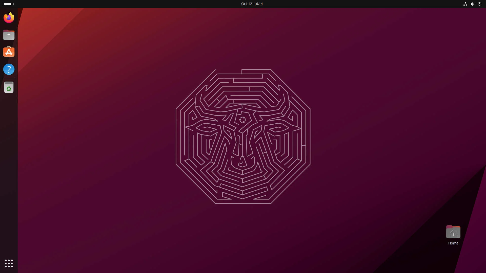
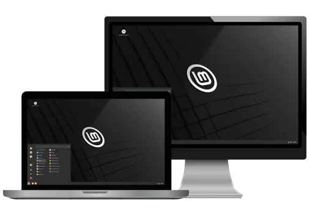
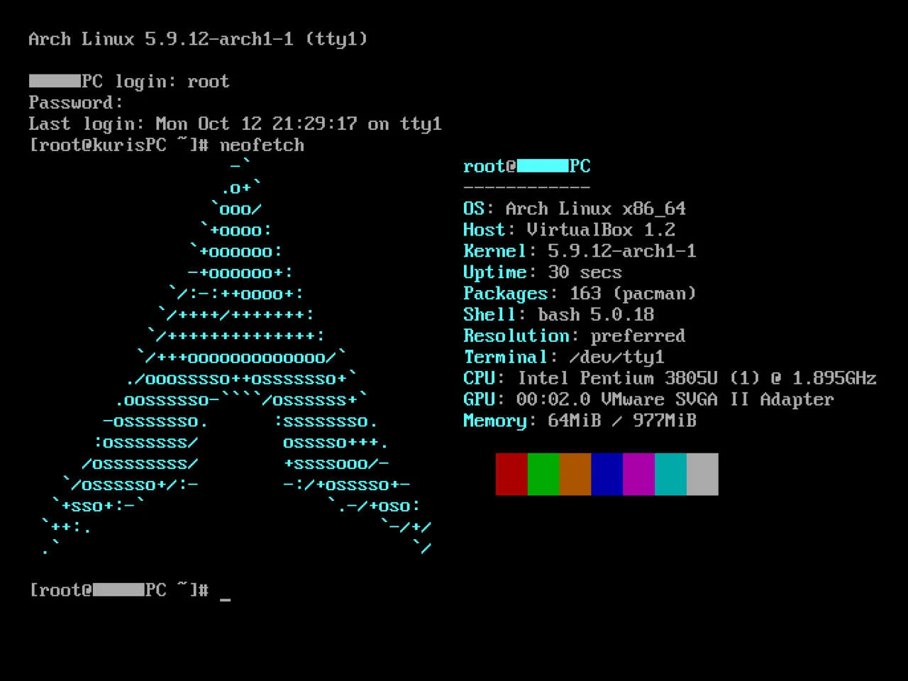
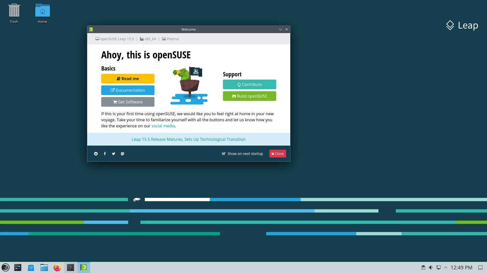

My Fedora journey started with their Workstation edition. Their vanilla Gnome experience in the beginning got me hooked to them.

But the story doesn't start from Fedora, it rather goes way back in time, when I was first introduced to Linux via Ubuntu. And I find it a breeze for my potato laptop at that time. My Linux Journey is quite complex. Take a look:



> [!DISCLAIMER]
> I honestly don't exactly even remember how much I have hopped to and from different distros, I haven't added vanilla Debian which I have used for a week. Neither, I have added immutable distros like **SilverBlue** and **OpenSUSE Aeon** which I have used for months combined. At the end of the day, use whatever distro you want and make it yours. Most of the Distros are fundamentally similar, and you can ideally do anything and everything on each and every distro.

**So let's jump back to the start, where it all began:**

## **Ubuntu: The Gateway to Linux Bliss**

I started using Linux exclusively about 4 years ago. Like every other person migrating or at least trying to migrate to Linux, my journey started with **Ubuntu[^1]**. As newbies, we don't know much about Linux controversies around Snaps, SystemD or countless other (countless! I'm not even kidding 🤔). We decide to take sides on the basis of what's popular opinion is, instead of educated decisions. And, I caught up in the hate train, and left for Linux Mint.

Ubuntu is one of my most favorite distros (Sorry, folks). I liked how Ubuntu team has customized gnome to the near perfection. Most important of all, font rendering on it, is unmatched, I couldn't find a single distro that handle fonts rendering that good out of the box. Due to this, my eyes feel very comfortable, when on Ubuntu. This is one of the many reasons I keep coming back to it.

Apart from being **closed-source** on the server side, the biggest reason I and many other people didn't like **snaps** were their horrible loading times. But this problem is nearly resolved in the recent **Ubuntu releases**, and loading times are even better than **Flatpaks** and closer to the native packages. First, I didn't care if snaps' server side is closed-source or not, but now I do, after I came across an old story[^11] from 2018 when a crypto miner slipped through Ubuntu defenses and got to the users, and a recent incident[^12] in 2023 about crypto phishing apps being published on the snap store.

- One can argue, these were close sourced apps, you are already at risk by trusting them.
- My counterargument will be, you can trust the well-known proprietary app, instead of a random person packaging what not, for you without being any oversight.
- In comparison, you can look at the flatpak's manifest file to see exactly what permissions are set and from where they're getting their source file for the said software.

## **Linux Mint: A Refreshing Taste of Simplicity**

I then, moved to **Linux Mint[^2]**. It was quite a good experience. I learned about **timeshift** and got to know about the concept of taking regular backups of your system, in case of emergencies. Linux Mint is a simple but very functional Distro. Their DE, Cinnamon, looks clean but offers a lot of flexibility too.

I personally like the rock solid nature of Linux Mint. I might migrate in the future when full Wayland support will be there. Apart from Wayland, there are very few things I miss on Cinnamon which aren't available else where (Due to the limitation or exclusivity of the DE).

## **Arch Linux: Embracing (Trying) the DIY Spirit**

Then the hype train of **Arch Linux[^3]** got me. First, I tried to install it manually by following the WIKI to type on Reddit, **BTW, I use Arch**. Due to the lack of enough experience and knowledge, I failed miserably. So, I moved back to Mint. If you're wondering, yes, I'm doing all this on the live system (I like to play tough). Then, I installed it by following a tutorial on YouTube (Arch Users: We don't talk about it). 

Arch Linux is good with high number of latest packages available. The best thing about Arch Linux is by far the ArchWiki, no matter which distro you use, you will eventually come across this amazing Wiki, and find the solution too. I have nothing negative to talk about Arch, just want to say, it was a bit fast moving target for me to chase.

For me, almost every other distro, just never breaks (some Ubuntu exceptions, though my tinkering might be the reason, it borked).  I'm specifically talking about updates. Arch Linux is a rolling release distro, so there are updates almost every day. **Being on the bleeding edge, backup is like a rule, not the choice**. But despite being introduced to **timeshift** on Linux Mint early on, I played with fire and never took regular (if any) backups.

> [!TIP]
> Later on, I discovered about Arch Mailing lists. One can subscribe to **Arch-announce[^8]** list to know about upcoming breaking changes where manual intervention after update is necessary otherwise your system may bork down. For every inspiring or current user, it is a must to check before proceeding with updates, especially any major ones.

## **openSUSE: Where Stability Meets Innovation**

**openSUSE[^4]** was a new shiny toy for me with built-in grub snapshots. I liked the implementation of **YAST** for doing almost everything. But after some time, I started missing the terminal. The idea of YAST is good, but again it wasn't for me.

The best thing about OpenSUSE is its **KDE Plasma** experience. Though I have started on **GNOME**, and then shortly after **Cinnamon**, but **openSUSE Tumbleweed** is the reason, I fell in love with Plasma DE. Honestly, I never tried KDE before, and even I don't like it after watching YouTube reviews. But the experience you get on Tumbleweed is quite remarkable. The openSUSE tools are built in QT, so they look superb there.

> [!INFO]
> As of November 2023, I use GNOME. I broke up with KDE after extensively using it for several months. Now, I even can't live without GNOME. A couple of months back, I tried to use KDE, but I was immediately lost, so many customization and settings made me not to use it. GNOME's simplicity is just wonderful. I use it with only 4 extensions which are just essentials nothing fancy (pano — clipboard, vitals — temp/memory/network monitor and more, Kstatus and AppIndicator, Caffeine - System Sleep timer).

I jumped ships to OpenSUSE quite early in my Linux journey. The Linux packaging formats and how they worked, I was unaware of. Soon, in this lack of expertise, I started to miss Arch and even Ubuntu (as almost every software is available as `.deb`). The concept of openSUSE build was not known to me. Quite frankly, I still don't know it either, how to build packages via OBS (openSUSE Build Service).

The third reason to leave OpenSUSE was, `zypper`. It's slow compared to other available package managers (look who's talking; Cough, cough! DNF 🙂). Not too slow (especially now when I'm using DNF), but it was evident as I was coming from Arch, where not only syncing/refreshing repos takes few seconds, but downloading update are speedier too.

## **Fedora Workstation: The Bleeding Edge of Linux**

During the times, I was dangling between Arch, Ubuntu, openSUSE and Mint, I noticed people were saying nice things about **Fedora's[^5]** GNOME experience. Unlike Ubuntu, Fedora Workstation comes with vanilla GNOME, which in itself is quite fascinating (IMHO not a single other distro unlike Ubuntu has the expertise to make GNOME look good).

Till now, you have noticed my resentment with **DNF**. It's sluggish as hell out of the box. I was immediately turned off, and left Fedora even sooner than Arch Linux (I left vanilla Arch sooner, but used Manjaro for a few months). Later in my journey, I came across [this](https://www.youtube.com/watch?v=RrRpXs2pkzg) video, which helped me make DNF suck-less (pun intended).

Then I fell in love with Fedora's semi-rolling release model. Unlike Ubuntu/Mint, I never have to look somewhere else for latest packages other than default repos. Fedora comes with a good number of packages in their repos. You will hardly ever need to look somewhere else for latest and greatest.

Now I have used Fedora Workstation, longer than any other distro (almost more than a year straight), It feels like a home. After the recent Red Hat's drama[^9], I tried to jump ships to openSUSE, and then even Ubuntu (sorry again folks), but I failed. I felt lost there. I know navigating through Fedora Workstation to the extent that I feel confident enough to manage it for my needs.

## **Immutable Distros: A Paradigm Shift in System Management**

I was introduced to the concept of immutable distros in the early 2023. An immutable distro is basically read-only (there are few exceptions) FileSystem. You are allowed to make changes in your `$HOME` dir, but `root` dir is the no-go area. They are catered towards security minded and non-tinkerers alike. People who just want their system to be bootable, and they don't have to worry about managing it, immutable distros are a way to go. They get updated in the background and then require to reboot to boot into the updated system snapshot.

I have tried these immutable distros so far:

1. SilverBlue[^6] (Fedora's Gnome DE based immutable distro)
2. OpenSUSE Aeon[^7] (OpenSUSE Gnome DE based immutable distro)

### SilverBlue

SilverBlue was my first introduction to system immutability. SB comes with `toolbx`, which is the recommended way for you to install packages other than Flatpaks and AppImages. It integrates the `guest container` on your system in such a way that it can access your `$HOME` dir. `toolbx` is great, but it only offers Fedora's containers. Then, I came across `distrobox`[^10] which allows you to run containers from a range of guest distros. It's inspired by `toolbx`, so, it does everything but better than `toolbx`.

SB also comes preinstalled with few basic utilities like PDF reader, Browser, Software Center etc. So, you can get going quite easily. I used SB for a couple of months. I enjoyed it, there were few nuances (which apply to all immutable distros), like the immutability itself which sometimes convert to hassle rather than a feature.

> [!TIP]
> If you've already embraced the container workflow for your projects. And you don't mind managing them. Then definitely you should give it a try in a VM and then decide whether it is for you or not. I'm still not able to embrace the containers' workflow fully. I'm certainly trying, and even using `distrobox` on my Fedora Workstation for a few things (both `toolbx` and `distrobox` use `podman` under the hood).

### openSUSE Aeon

I have used Aeon for about 2–3 weeks on my main machine. I liked it more than SB. Aeon is everything done right with the immutable distro IMHO, why, I'm glad you asked:

1. It doesn't install Utilities in root filesystem unlike SB, rather than embrace Flatpaks for almost everything (obviously other than system binaries).
2. The presence of `distrobox` in the root FS, instead of us layering it, is a chef kiss.
3. The less/nonexistent bloat in the name of necessary utilities, as almost every widely used application is available on [flathub](https://flathub.org), and user can install them at their discretion.

## **Wrapping Up: A Linux Odyssey**

1. **What I've learned?**
A lot, I feel more confident when talking about Linux or even OSs in general. Each distro, though fundamentally similar, teaches you few new things. No matter which distro I used, my knowledge base was evolving about Linux. I still consider myself a newbie and plan to keep it that way. To me, being a newbie means having a fresh and open mindset, always eager to learn more (and conveniently, it comes with a 'noob' pass — immunity to getting called out for silly mistakes!).

2. **Are there any regrets?**
The biggest regrets are, how much I have wasted time by not taking backups, trying or hopping to other distros for silly reasons. I could have learned a lot more, if I have just fixed the OS, instead of going through the hassle of installing and reinstalling.

3. **How would I approach these four years differently if given the chance to relive them?**
First and the most important of all, I wouldn't install each and every shinny distro on my main machine, instead will try them in a VM. I would stick to more main stream distros like vanilla Fedora, Debian and Arch (Linux Mint would still be an exception). I would not decide the distro based on the political reasons, rather in which, I'll be more comfortable.

> [!DISCLAIMER]
> I do care about freedom of choice and open source. Not only that, I was attracted towards Linux because of the growing privacy concerns and malpractices of Microsoft. I try to use open source and privacy respecting applications and pieces of software on my PC and phone. I have extensively used Custom ROMs for similar reasons.

In the end, use the distro you like and customize it to your liking, and don't get carried away by shinny new Distros or DEs (some people call it Distro or DE syndrome). If you want to use them, spin a virtual machine and try them there.

> “So, here's to staying forever new, embracing the mistakes, and relishing the joy of discovery. Happy learning, fellow newbies!”

## References

[^1]: <https://ubuntu.com/download/desktop>
[^2]: <https://linuxmint.com/>
[^3]: <https://archlinux.org/download/>
[^4]: <https://www.opensuse.org/>
[^5]: <https://fedoraproject.org/workstation/>
[^6]: <https://fedoraproject.org/silverblue/>
[^7]: <https://en.opensuse.org/Portal:Aeon>
[^8]: Arch Announce Mailing List: <https://lists.archlinux.org/postorius/lists/arch-announce.lists.archlinux.org/>
[^9]: Red Hat Drama: <https://www.theregister.com/2023/06/23/red_hat_centos_move/>
[^10]: Read more about Distrobox: <https://github.com/89luca89/distrobox>
[^11]: Malicious Package found on Snap Store: <https://www.bleepingcomputer.com/news/linux/malicious-package-found-on-the-ubuntu-snap-store/>
[^12]: Crypto Phishing Apps found on Snap Store: <https://forum.snapcraft.io/t/phishing-app-on-the-snap-store-is-my-computer-compromised/37045>
