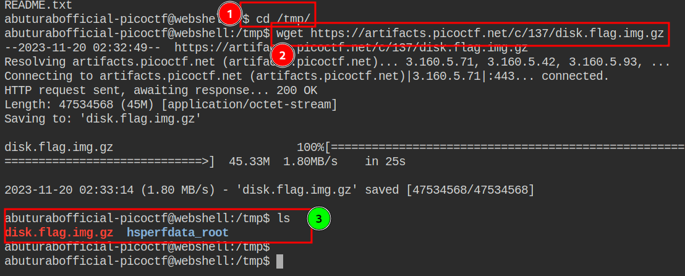
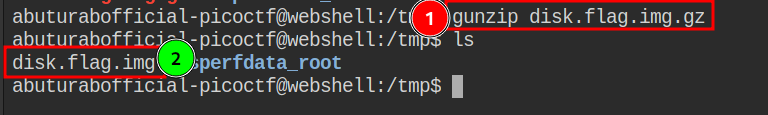
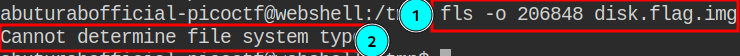
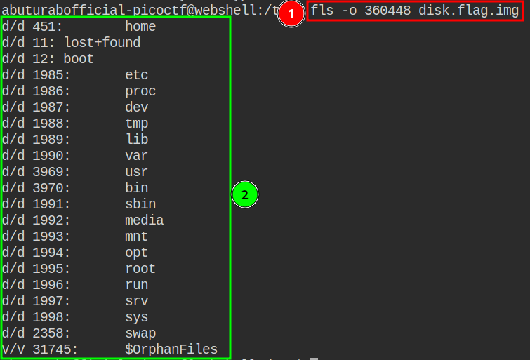
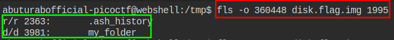
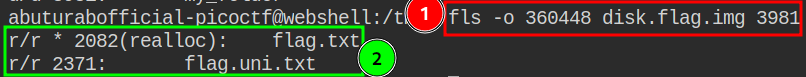
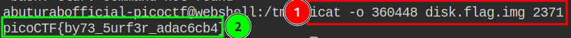

Sleuthkit Apprentice Challenge is about doing forensic analysis of disk images and finding the useful and juicy information about the target.

## **Necessary Information[^1] Before Starting the Challenge**

- Disk image is a huge dump of many numbers
- Those numbers have invisible structures
- Sleuthkit makes navigating those structures much easier

**The four layers of disk images are:**

### 1. media
- `mmls` is a media layer tool, gives partition table and key info for delving into other layers
- Media is the lowest level, providing key information to access the deeper layers, but not shedding much light on the data contained in the image

### 2. Block
- 2nd lowest layer
- Block layer tools are prepended with `blk` in the Sleuthkit.
- `blkcat` Tool that outputs the contents of a single block.
- The block layer is the number of the disk image broken into equal-sized chunks.
- A single file may contain multiple blocks.

### 3. Inode
- Bookkeeping layer, like a table of contents with chapter numbers being like the inodes, and the pages like the blocks of a file
- Inode layer tools are prepended with `i`
- `icat` is a tool that outputs a single file based on its inode number

### 4. Filename
- The layer that the most users see and interact with
- Interacting with file layer is like a normal shell operation
- The tools are prepended with `f`
- `fls` is a tool that lists the files on an image starting at the root

## **The Walkthrough**

The Challenge[^2] require us to download the disk image, decompress, and then find the `flag` by looking at different layers of the `.img`.

### Login to the WebShell

Login to the picoCTF [WebShell](https://webshell.picoctf.org/) or you can use your own VM. In my case, I will use the picoCTF WebShell.

### Download the Challenge File

To keep your home directory clean, move into the `/tmp` DIR, and use `wget` command to download the given disk image.
Check if the `.IMG` file has been downloaded into your `tmp` DIR, use `ls` command which will list all the files (except hidden ones) in the DIR.

```console
wget https://artifacts.picoctf.net/c/137/disk.flag.img.gz
```



### Decompress the File

As you have noted in the previous step, the downloaded file is a `.gz` compressed archive. To decompress it, we need a separate tool called `gunzip` which comes preinstalled on most of the Linux Systems.

```console
gunzip disk.flag.img.gz
```

After this, we will get uncompressed disk image `disk.flag.img`, the `gunzip` will automatically delete the uncompressed `.gz` file.



### Using `fls` to List the Partition Content

We will use `mmls` tool, to see the partition tables, and find the OFFSET value.

```console
mmls disk.flag.img
```


As in the screenshot `label#2` it looks like the largest partition, and it’s labeled as `0x83` for Linux, it’s a bit of a guess, but we can list its content by using the `Start` OFFSET value supplied into `fls` tool.

Lets to be sure, check the content of `partition#003` by supplying the OFFSET value

```console
fls -o 206848 disk.flag.img
```



As it throws error, we will move on to the next partition.

Now let's check the contents of the largest partition `#004`:

```console
fls -o 360448 disk.flag.img
```



Now we will look at the contents of each dir, to do this we will again use the `fls` command.

First, we will look at the `home` directory:

```console
fls -o 360448 disk.flag.img 451
```

The `home` dir seems to be empty, so we will move on.

Let’s look at the `root` dir:

```console
fls -o 360448 disk.flag.img 1995
```

> [!TIP]
> We need to make smart decisions about which directory to look at first, to avoid wasting time. Please read about Linux directory structure to know more about which directory contains what.



There might be some juicy stuff in the `root` dir, so let’s investigate further. Lets look into `myfolder`:

```console
fls -o 360448 disk.flag.img 2363
```

I think, we got our flag:



We can see the `flag.txt` file in the `my_folder` dir. We need to look at the content of this file to find out our flag.

To see the contents of individual files, we will use the `icat` command, as `fls` can only list the dir content:

```console
icat -o 360448 disk.flag.img 2371
```

Voilà, we got our flag:

```plaintext
picoCTF{by73_5urf3r_adac6cb4}
```



Paste the flag in the picoCTF `flag box`, and you’re done. Now take a deep breath and have a moment to enjoy your achievement.

## References

[^1]: A good [resource](https://primer.picoctf.com/) if you want to learn basics.
[^2]: The Challenge can be found [here](https://play.picoctf.org/practice/challenge/300).
